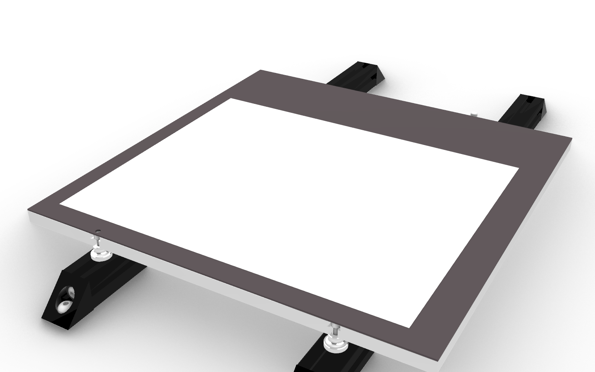
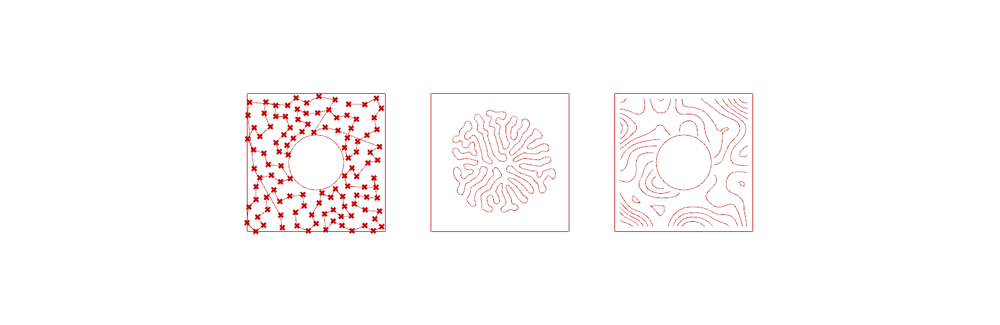

# Voron 2.4 Pen Plotter Pipeline

Grasshopper-driven pen plotter running on the Voron 2.4 (350) via Klipper/Moonraker.
Parametric linework generators -> multi-pen G-code with paper registration,
self-calibrating pen height, and a preview that renders the exact emission plan.



## Architecture

```
GENERATORS            LAYER TABLE         PLACE              GCODE                PREVIEW
mesh / lake /   ->    6 slots, one   ->   registration  ->   passes by pen,  ->   draws the actual
radial / baked        pen # each          fit / lock /       signature,           plan, 8 pen
+ DOTS ingest         (0 = off)           direct bypass      manifest             colours, paper slab
+ processors: DASH, CHROMATIC ABERRATION, and eight region fills - HATCH
  (lines/concentric), HILBERT, FLOW FIELD, SERPENTINE, TRUCHET, STIPPLE/TSP,
  DIFFERENTIAL GROWTH, CONTOUR
```

All processors share one contract - curves in, curves out, plus an `on` bypass -
so they chain freely (hatch a region, dash the result, split it through
chromatic aberration onto separate pens...).




- **Coordinate convention:** the whole pipeline works in PEN-SPACE (physical ink
  positions). The pen sits 54.5mm in front of the nozzle; the offset is applied
  only when G-code text is written.
- **Pressure channel:** a curve's Z coordinate = pressure offset in mm (spring
  pen mount; negative = press harder). Emitted only when it changes.
  The PRESSURE processor writes it (curvature / proximity / image / noise);
  because it rides on the geometry it survives resampling, PLACE's fit scaling
  and chaining, so stacked PRESSURE blocks ADD. GCODE's `pressure_gain` scales
  the whole channel at emission (0 = plot flat) without re-running anything.
- **Pen palette (pass order):** 1 BLACK, 2 RED, 3 GREEN, 4 BLUE, 5 YELLOW,
  6 ORANGE, 7 AQUA, 8 PINK.

## Files

| File | What |
|---|---|
| `plotter.gh` | The Grasshopper definition (canvas UI: sliders, dropdowns, PLOT button) |
| `plotter_workspace.3dm` | Rhino workspace with the bed model aligned at physical coords |
| `place_component.py` | PLACE: art -> paper mapping, FIT/1:1, placement LOCK, DIRECT bypass |
| `gcode_component.py` | GCODE: sampling, per-pen passes, signature, manifest, emission |
| `preview_component.py` | PREVIEW: thin display shell (plan geometry drawn raw) |
| `dash_component.py` | DASH processor (curves -> dashed curves), template for processor blocks |
| `ca_component.py` | CHROMATIC ABERRATION processor (curves -> 6 offset colour steps) |
| `hatch_component.py` | HATCH fill: parallel lines / concentric insets (Clipper2) |
| `hilbert_component.py` | HILBERT fill: space-filling curve, one continuous stroke |
| `flowfield_component.py` | FLOW FIELD fill: evenly-spaced streamlines through a noise field |
| `serpentine_component.py` | SERPENTINE fill: scanlines snaked together, pen stays down |
| `truchet_component.py` | TRUCHET fill: random arc/diagonal tiles chained into loops |
| `stipple_component.py` | STIPPLE / TSP-ART: blue-noise dots (-> DOTS block) + one-line tour |
| `growth_component.py` | DIFFERENTIAL GROWTH: self-repelling loop folds into coral forms |
| `contour_component.py` | CONTOUR: noise terrain -> topographic iso-lines |
| `pressure_component.py` | PRESSURE: writes the Z pressure channel (curvature/proximity/image/noise) |
| `crop_component.py` | CROP: clips curves to any closed shape(s), even-odd so nested = holes |
| `paper_registration.json` | Last taught paper corners (also stored on the printer) |

## Printer-side (in this repo's config)

- `pen_macros.cfg`: `PEN_PAUSE` (non-parking pen swap w/ colour prompt),
  `PEN_RESUME` (no un-retract - NEVER use stock RESUME for pen plots),
  `PEN_RESTORE_LIMITS`, `PLOT_HOME_QGL` (conditional homing/QGL),
  `PAPER_SET_FL/FR/BL` (3-corner paper registration teaching, persisted via
  save_variables).

## Plot workflow

1. Paper down. If it moved: jog pen to 3 corners -> `PAPER_SET_FL/FR/BL`
   buttons -> `PULL registration` in Grasshopper.
2. Read the JOB MANIFEST panel (passes, time, warnings - PLOT refuses if out
   of bounds).
3. Press PLOT (uploads + starts). Machine homes/QGLs (only if needed), slowly
   traces the plot bounding box for an alignment check, then presents at the
   auto load point just off the paper edge.
4. Seat pen to bed surface, tighten, `PEN_RESUME`. It signs "JC", draws a
   calibration row (babystep Z window), then plots the pass.
5. Repeat seat/resume for each pen pass (display names the colour to load).

## History

Built pair-programming with Claude via a Rhino MCP bridge (Keratin) driving
the Grasshopper canvas programmatically. G-code, macros, registration system,
multi-pen passes, pressure channel and preview architecture all generated and
iterated in-session.
