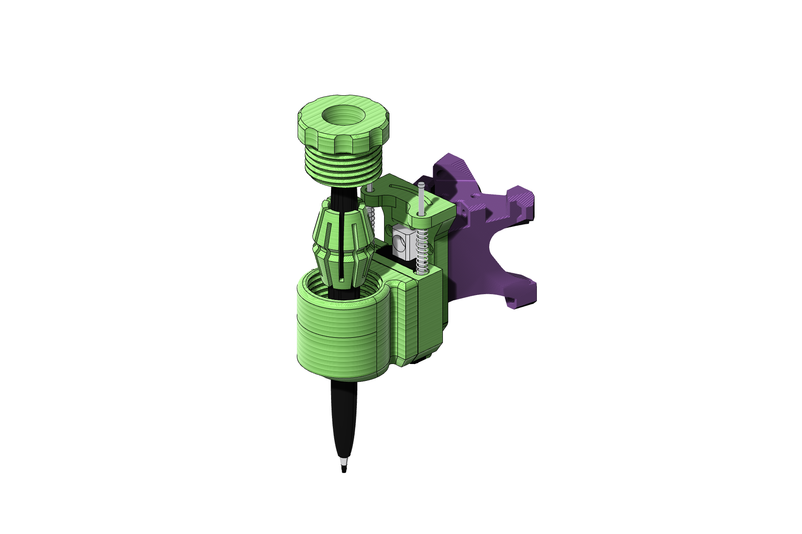
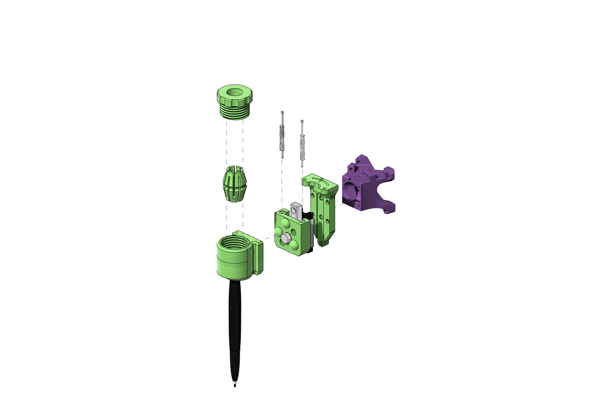
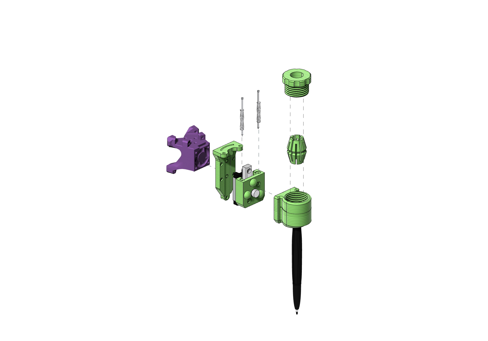
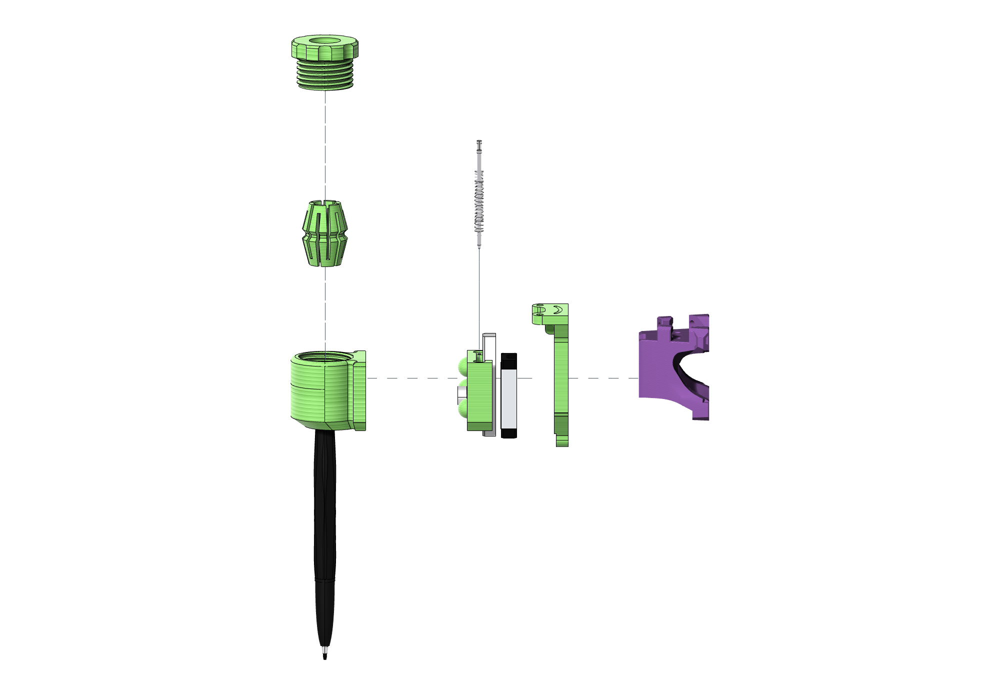
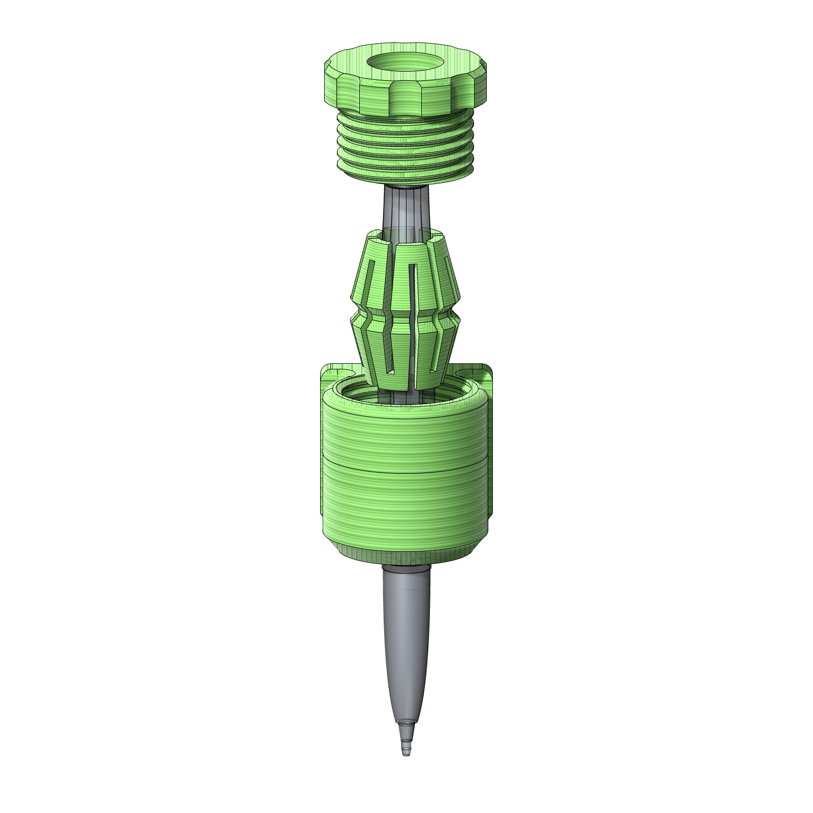
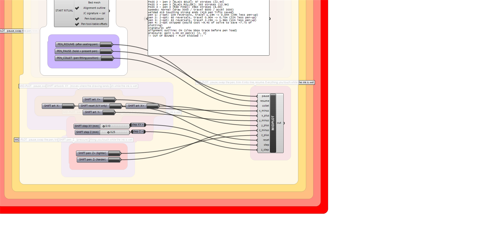
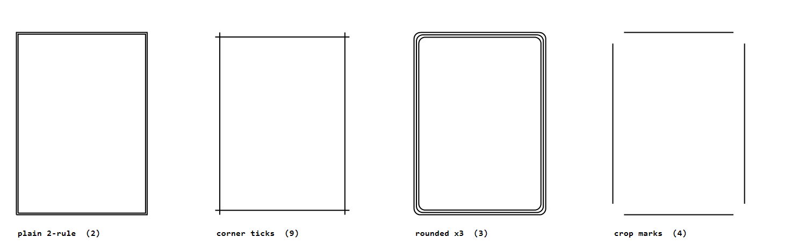
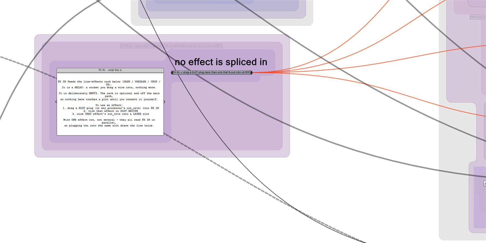
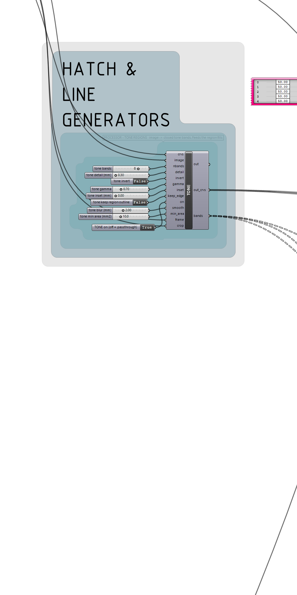

# Voron 2.4 Pen Plotter Pipeline

This is my design for a pen plotter that uses a small linear rail, a couple of magnets, some pen springs and some old nails for very precise and repeatable multi colour pen plotting.
It's currently setup to fit the fan mounting holes of my Voron 2.4 architype toolhead, but should fit pretty much any printer with some slight adjustment to the mounting holes.

Rhino3D Grasshopper plugin generates the linework and this complex pipeline turns it into multi-pen
G-code, and Klipper macros handle registration, pen swaps and per-pen
calibration. The Rhino viewport is a digital twin of the GH canvas: the bed, the registered
sheet of paper, the exclusion sonze as a result of the offset pen and the exact emission plan, displayed at the pen widths (and even parametrically controlled pressure) that will
actually lay the ink.

## Hardware

The plotter is a removable pen toolhead built around the Archetype interface.
It replaces the hotend fan for plotting (2 screw swap), but does not require permanent changes
to the Voron. A short MGN9 rail (leftover from a previous TAP (https://github.com/VoronDesign/Voron-Tap) constrains the pen carrier, twin springs provide
compliant drawing pressure, and a self-centring collet keeps different pen
diameters on the same axis.



### Mechanism

1. **Archetype interface.** The purple rear bracket shows the current archetype hotend mount I'm using (Mjolnir configuration with Rapido Ultra UHF)
2. **Linear guidance.** The 50 mm MGN9 rail and MGN9H carriage are the same
   parts used by the Voron **TAP nozzle-levelling design**. They allow only
   vertical pen motion, preventing the lateral play that would show up as
   doubled or offset lines.
3. **Compliant pressure.** Two compression springs preload the moving carrier.
   Klipper commands nominal Z contact and the springs absorb bed/paper variation;
   pressure modulation is implemented as small additional Z compression.
4. **Repeatable pen axis.** The split collet closes concentrically around the
   barrel when the threaded lock nut is tightened. Different barrel diameters
   therefore remain centred instead of being pushed against one side of a clamp.
5. **Fast changes and calibration.** A magnetic quick release makes multi-pen
   swaps tool-free. The software stores a separate XYZ datum for each pen to
   correct its length and small re-seating differences.

The pen tip is roughly **52 mm in front of the nozzle datum**. The Grasshopper model
stays in pen coordinates; that fixed hardware offset is applied only when
G-code is emitted. Travel hop must exceed the spring preload, or the pen never
fully clears the paper.



<p align="center">
  
  
</p>

### Bill of materials

> **Complete download:** [Pen Holder QR V3: Collet Update](https://github.com/stormfunk/Voron-2.4-Cyber-Brain-/releases/tag/pen-holder-qr-v3.0.0)
> contains the full printable set as one ZIP.

| Qty | Part | Specification / repository file | Purpose |
|---:|---|---|---|
| 1 | Archetype toolhead interface | Existing Archetype mount; purple part shown above | Fixed connection to the Voron toolhead |
| 1 | Linear rail | MGN9, 50 mm long, as used by the Voron TAP nozzle-levelling design | Vertical guide |
| 1 | Linear carriage | MGN9H, matching the Voron TAP carriage | Low-play moving bearing block |
| 2 | Compression springs | Approx. 4.4 mm OD × 25.5 mm free length in the CAD | Compliant pen preload |
| 2 | Guide fasteners | Approx. M2.5 × 50 mm in the CAD; verify against printed holes | Spring and carrier guidance |
| 1 pair | Neodymium magnets | Size to suit the modelled quick-release pockets (10mmx4mm)| Repeatable, tool-free carrier attachment |
| 1 set | M3 mounting hardware | Lengths to suit the Archetype interface and MGN9 rail | Rail and bracket fastening |
| 1 | Rail mount | [`01_Linear Rail Mount.stl`](hardware/pen_mount/01_Linear%20Rail%20Mount.stl) | Fixed rail support |
| 1 | Moving carriage body | [`02_Linear Rail Carriage.stl`](hardware/pen_mount/02_Linear%20Rail%20Carriage.stl) | Spring-loaded carrier body |
| 1 | Collet holder | [`03_Collet Holder.stl`](hardware/pen_mount/03_Collet%20Holder.stl) | Threaded housing for the collet system |
| 1 | Collet lock nut | [`04_Collet Lock Nut.stl`](hardware/pen_mount/04_Collet%20Lock%20Nut.stl) | Closes and locks the collet |
| 1 | Default collet | [`Collet Default.stl`](hardware/pen_mount/Collet%20Default.stl) | **Recommended starting point; designed to fit most pens** |
| Optional | Sized collet | [5 mm](hardware/pen_mount/Collet%205mm.stl), [7 mm](hardware/pen_mount/Collet%207mm.stl), [9 mm](hardware/pen_mount/Collet%209mm.stl), [11 mm](hardware/pen_mount/Collet%2011mm.stl), [13 mm](hardware/pen_mount/Collet%2013mm.stl), or [15 mm](hardware/pen_mount/Collet%2015mm.stl) | Optional alternatives for a known pen-barrel diameter; print only the size required |
| 1 | Pen or marker | Use the default collet first; switch to a labelled size only when needed | Drawing cool shit |

The spring, magnet and fastener dimensions above reflect the current CAD. Check
the printed pockets/holes before ordering if you change slicer compensation or
exported geometry. Printable files, dimensions and datum notes are collected in
the detailed [Pen mount](#pen-mount) section below.



---

## Software architecture


---

```
GENERATORS         PROCESSORS          LAYER TABLE      THINOUT       PLACE            GCODE            PREVIEW
mesh / lake /  ->  chained freely  ->  6 slots,     ->  drops     ->  registration ->  passes by    ->  draws the
radial / baked     curves in,          one pen #        ink the       fit / lock /     pen, ordered     actual plan,
+ DOTS ingest      curves out          each             pen can       direct bypass    travel,          8 pen colours,
                   + `on` bypass       (0 = off)        not resolve                    manifest         paper slab
                                                                          ^
                                            TITLEBLOCK ----------------- merges into GCODE as a
                                            (sizes itself to the paper)  second source after PLACE
```

Every processor shares one contract: `crvs` in, `out_crvs` out, plus an `on`
bypass. That is what lets them chain in any order. Hatch a region, dash the
result, split it through chromatic aberration onto separate pens, crop it to a
shape.

### Conventions

- **Everything is pen-space.** The whole pipeline works in physical *ink*
  positions. The pen sits **51.9 mm in front of the nozzle**; that offset is
  applied only when G-code text is written. Nothing upstream ever thinks about
  the nozzle.
- **Z is the pressure channel.** A curve's Z coordinate is a pressure offset in
  mm (spring pen mount, negative = press harder), emitted only when it changes.
  Pressure rides on the geometry, so it survives resampling, PLACE's fit scaling
  and chaining, and stacked PRESSURE blocks *add*. `pressure_gain` on GCODE
  scales the whole channel at emission (0 = plot flat) without re-running
  anything upstream.
- **Pen palette (also the pass order):**

  | # | Pen | Width |
  |---|---|---|
  | 1 | BLACK FINE | 0.3 mm |
  | 2 | BLACK BOLD | 0.7 mm |
  | 3 | BLACK ROLLER | 0.8 mm |
  | 4 | RED FINE | 0.3 mm |
  | 5–8 | CUSTOM 1–4 | set per pen |

  Widths live in `pen_widths.json` and do real work: they set THINOUT's culling
  distance per pen and drive the viewport preview lineweight.

- **Switching a processor on and off.** Most have a boolean toggle beside them,
  because their bypass passes curves straight *through*. Disabling such a node
  emits nothing at all and breaks the chain rather than stepping out of it. The
  ones that produce nothing when off (TITLEBLOCK, PAPERCAM, SEPARATE, SVGIN,
  FRAME) have no toggle: enable or disable the node itself.

---

## Canvas tour

The whole definition, left to right: hardware setup and pen calibration, then
generators, then processors and region fills, then assembly (layer table,
titleblock, placement), then G-code emission, then the preview and pen legend.


### Paper registration


Jog the pen to three corners of the sheet and press the buttons. Klipper stores
the corners in `save_variables` and the result is pulled straight back into
Grasshopper, so the paper outline updates live in the viewport as each corner
lands. Three points handle a **skewed** sheet: the paper frame is derived from
them, so artwork is rotated to match rather than assuming square.

The jog buttons are laid out as a cross, oriented as you look down at the bed:
Y+ away from you, X+ to the right, `home` in the middle. The TEACH buttons sit
in the same relation as the corners they teach.

PULL lives on the console itself. Teaching a corner already re-reads the
printer, and `reg_json` is emitted on every solve, so a fresh session already
knows where the sheet is.

The area behind the paper that the pen cannot reach (a consequence of the
51.9 mm offset) is drawn as a red hatched exclusion zone.


### Optical registration


> **Status: parked.** It calibrates to 0.34 mm and finds the sheet reliably, but
> it is not in the working flow. Use the manual three-corner registration above.

Finds the same three corners with a bed camera instead of jogging to them. The
camera is fixed and the bed is flat, so image → bed is a **homography**, which
absorbs the camera's tilt, offset and lens scale into one 3×3 matrix.

**Calibrate once.** `target_crvs` emits a grid of discs at known machine
coordinates; plot them in DIRECT placement so they land exactly where commanded,
then press CALIBRATE. Because the machine drew them itself, the coordinates are
exact by construction and the result maps the camera to machine coordinates.
Marks are placed within X 0–350 and **Y 0–292**, since the pen cannot reach the
back strip.

Use more than four marks. The fit is then over-determined, so the residual per
mark is a real measure of lens distortion or a shifted camera rather than the
zero that four points always give.

A flipped or rotated camera needs no correction, but any change to camera
mounting or orientation invalidates a stored matrix, so recalibrate after one.
Autofocus must be off (`focus_absolute=2`) or the geometry drifts between
sessions.

**Then per sheet:** CAPTURE grabs a frame, thresholds it by Otsu (paper is far
brighter than the bed), and fits lines to the four paper edges. APPLY writes the
corners to `paper_registration.json` in the same shape the manual TEACH buttons
produce, so nothing downstream changes.

**Mount the camera overhead, not in a corner.** A corner mount cannot see the
whole bed at a normal 60° field of view, and its scale varies about 4.5× across
the bed. Overhead gives a uniform ~0.15 mm anywhere on the bed: a standard 60°
webcam needs about **560 mm** above it, a 78° wide-angle about **430 mm**. The
capture reports actual mm/px at each detected corner.

An overhead camera looks straight through the gantry, so `PLOT_CAM_PARK` (in
`cam_macros.cfg`) moves the beam to the back of the bed and raises Z before
capture. That strip is already unreachable by the pen, so it costs no printable
area.

Judge lighting by how many marks survive detection, not by how bright the frame
looks: auto-exposure holds the mean constant while glare changes completely. One
controlled source works best, chamber strip on and room light off. Pinning the
exposure through crowsnest does not work, because it applies v4l2 controls
before ustreamer opens the device and the driver resets them on format set.

`debug` writes an annotated frame to `screenshots/papercam_debug.png` showing
the detected quad, which is the fastest way to see what it is latching onto.
Expect the threshold and `min_area` to need tuning against a real bed.

### Pen tool table


A CNC-style tool table. Each pen gets its own stored XYZ datum, **independent
of plot order**, so swapping a fat pen for a thin one does not throw the
alignment out. The flow is: fit the pen at the collet position, go to the
calibration point, jog the tip onto the dot by hand, then STORE. `apply` loads
that pen's offset; `table` prints what is stored; `clear` forgets one.

**`commit` makes a mid-plot babystep permanent.** Nudge a pen with the live trim
and that nudge normally dies with the job; commit folds it into the pen's stored
datum instead. Nothing moves when it runs, so it is safe mid-pass.

**Pen 1 is the datum** every other pen is measured against, so a trim on pen 1
cannot be folded into the table. A pen 1 height error is a global draw-height
error: change `pen_down_z`, or re-run STORE at the cal dot to move the datum.

Calibration runs in raw machine space. `PEN_CAL_POS` zeroes the live G-code
offset before moving, because `G0` obeys `SET_GCODE_OFFSET` and one left
standing shifts where each pen "reaches" the dot. Its start height tracks the
mount: set `PEN_CAL_POS`'s default Z to whatever pen 1 stores, or calibration
starts inside the bed.

### Mid print controls



Pen handling and live trim in one console: pause, swap the pen, nudge the new
tip into line, resume.

`PEN_PAUSE` holds for a swap and `PEN_RESUME` continues without un-retracting.
Never use Klipper's stock RESUME for a pen plot; it will un-retract into the
paper. `PEN_COLLET` sends the head to the pen-fitting position.

The trim half is the babystep analogue on all three axes: X/Y shift *where the
drawing lands*, Z is pen height. Klipper accumulates the adjusts and they
persist to the end of the plot, so the running total is reported after every
press. Reset clears X/Y only: zeroing Z mid-plot would lift the pen off the
paper.

### Pen widths


Store the real line weight of each pen once. THINOUT then culls at the right
distance and the viewport draws at the right thickness, with no manual spacing
parameter to keep in sync.


### Generators


Pattern generators are just curve sources. Baked Rhino curves work equally
well, and slot 1 is wired for exactly that.

### Border and frame



Four corner treatments from the same six sliders: plain, corner ticks, crosses,
and open corners for crop marks. `rules` and `gap` give concentric lines,
`radius` rounds them.

`inset` is negative by default, which puts the frame **outside** the artwork
rect. Positive values place it over the image, and the component says so in its
message.

It is drawn in **artwork space, before placement**, so the border scales,
rotates and lands with the picture. It emits nothing when off, so enable or
disable the node to include it, and dock it into a layer slot to give it a pen.

### SVG import


Point it at an `.svg` and it emits plotter curves with a pen number each, so the
rig draws artwork from Illustrator, Inkscape, Figma or a plotter-art library.

It handles the parts of SVG that describe a line: every path command including
relative forms, arcs, and the smooth/shorthand curves, plus `rect` (plain and
rounded), `circle`, `ellipse`, `line`, `polyline` and `polygon`, with transforms
composed down the whole element tree. Everything is flattened to polylines and
`tol` sets how finely. Hidden elements and `<defs>` blocks are skipped, and
fills are ignored.

Pens come from one of three mappings:

| `pen_mode` | mapping |
|---|---|
| ONE PEN | everything on `pen` |
| BY LAYER | each top-level `<g>` becomes the next pen, which is how Illustrator and Inkscape both write layers |
| BY COLOUR | each distinct colour becomes the next pen, in the order first seen |

Colour falls back to `fill` when there is no `stroke`, and inherits down the
tree. Only layers that actually contain geometry consume a pen index, so a stray
`<defs>` block does not shift everything by one.

### The layer table


Six slots, each assigned a pen number (0 = off). Slots are interchangeable:
any curves into any slot. The pen number, not the slot, decides which pass the
linework ends up in.

Invalid curves are dropped here and the count is reported per slot, so a source
producing rubbish is visible rather than taking the table down with it.

### Processors


DASH, VARIABLE DASH (ink/gap driven by length or attractor proximity),
CHROMATIC ABERRATION (splits a curve into offset colour steps across pens),
CROP (clips to any closed shape, even-odd so nested shapes cut holes), and
PRESSURE (writes the Z channel from curvature / proximity / image / noise).

The rack sits off the main path, fed by a relay called FX IN that is empty by
default, so nothing here touches a plot until you wire it. To use one: drag a
slot plug into FX IN, switch that effect on, and wire *that* effect's
`out_crvs` into a layer slot. Wire one effect out, not several: they all read
FX IN in parallel, so plugging two into the same slot draws the line twice.



### Region fills


Nine ways to fill a closed region:

| Fill | Character |
|---|---|
| HATCH | parallel lines or concentric insets (Clipper2) |
| HILBERT | space-filling curve, one continuous stroke |
| FLOW FIELD | evenly-spaced streamlines through a noise field (Jobard–Lefebvre) |
| SERPENTINE | scanlines snaked together, pen never lifts |
| TRUCHET | random arc/diagonal tiles chained into loops |
| STIPPLE / TSP | blue-noise dots, or one continuous tour through them |
| DIFFERENTIAL GROWTH | self-repelling loop folded into coral forms |
| CONTOUR | noise terrain sliced into topographic iso-lines |
| PAW PRINTS | scattered cat-paw motifs, rotated and size-varied |

#### Paw prints

A *motif* fill rather than a line fill: instead of covering the region with
strokes it tiles it with one repeated drawn shape, a heel pad and four toes,
five closed curves per paw. `fill` above zero adds concentric insets inside
each pad, darkening it toward the solid look of printed paw artwork; left at
zero it draws outlines only.

Paws are placed on a staggered grid with jitter rather than scattered randomly,
and a paw is dropped rather than clipped if it does not fit entirely inside the
region. `seed` changes the arrangement and the same seed always gives the same
one, so a plot you are halfway through drawing does not move when something
upstream changes.


### Image processors

#### Tone regions



Image in, closed regions out, one set per tone band. This is what lets a
photograph drive the region fills, which otherwise only accept closed curves.

Two outputs, both useful alone:

- **`out_crvs`**: every band boundary as linework. A posterised portrait in
  outline, drawable as it stands.
- **`bands`**: a tree, one branch per band, **darkest first**. Feed branch 0
  into a tight hatch, branch 2 into a loose one, branch 3 into PAW PRINTS.

Bands are cut by difference rather than nesting, so they tile the region exactly
once instead of stacking ink two or three deep over the darkest areas.

`crop` takes left, top, right and bottom as fractions of the image, measured
from the **top-left**, so a photograph can be framed without leaving the canvas.
`smooth` blurs before banding and `min_area` drops specks; without both, fur and
film grain each become their own closed loop.

A workable chain for a photograph: crop to a silhouette so the background does
not generate as much contour as the subject, 4–5 bands, darkest into a tight
hatch, mid-tones into a wider hatch at a different angle, one light band into
paw prints, boundaries kept as pen 1 linework. Detail thinner than the sampling
grid, such as whiskers, will not survive banding at any setting; draw those as
curves.


POINTILLISM turns an image into dots: density, halftone or scattered, each dot
spiral-filled so it reads as a solid at pen width.


ASCII SHADER renders an image as drawn characters. Rather than mapping
brightness onto a ramp, each cell is sampled into a 3×3 grid and the character
whose own ink distribution best matches is chosen, so edges survive: an edge
running bottom-left to top-right picks `/`, a horizontal one picks `=` or `_`.
The `edge` slider trades shape-matching against pure density.
(Technique after [alexharri.com/blog/ascii-rendering](https://alexharri.com/blog/ascii-rendering).)

Auto-levels runs before matching and the range used is reported in the manifest;
`gamma` applies on top. Characters with no glyph in the stroke font are dropped
and named rather than silently drawing nothing.


### Colour separation


Each pen lays a translucent film of its own ink, so on white paper the mixing is
**subtractive**: a pen doesn't add its colour, it removes the rest. The
separation works in absorption space (`absorb = 1 − colour`), where inks laid on
the same spot add together, and asks how much of each pen reproduces the pixel:

> minimise ‖ Σᵢ xᵢ·absorbᵢ − absorb_target ‖² , with 0 ≤ xᵢ ≤ 1

Each pen's coverage is drawn as a halftone dot whose **area** tracks coverage,
on a grid rotated to that pen's own screen angle. Rotating the screens apart is
what stops the passes forming moiré, the same reason process printing uses
15°/75°/0°/45°.

The inks are whatever pens you actually own: the pen legend's colour swatches
wire straight into `inks`, so a black/red/amber set separates as black/red/amber
rather than pretending to be CMYK.


**It is ink-hungry.** A 160 × 120 mm image at a 2.2 mm screen came to 10,198
strokes and 65 m of line across three passes. `cell`, `gamma` and `max_ink` are
the levers; `max_ink` caps total coverage per cell so the paper doesn't
saturate.


### Thinout


Sits in the main flow with a bypass. When strokes run closer together than the
pen is wide, the second lays ink on top of the first: no visual gain, full
plot-time cost. THINOUT removes the covered portions at each pen's own stored
width, culling each pen against itself only, since a red stroke beside a black
one is not redundant. Longest strokes are processed first so the major linework
survives.

On a dense plot: 52.25 m of ink → 46.47 m, 11% removed, no visible loss.

### Placement


Five modes: registered paper, bed-centred, direct (use the curves' actual
position in space), driven from a graph, or **corner stop**. FIT scales artwork
into the sheet; LOCK freezes a placement so edits upstream do not shift it. The
paper preview stays visible in every mode so curves can be oriented against it.


#### Corner stop

Alignment marks are scribed on the bed one inch in on both axes. Butt the
sheet's front-left corner into them, pick the size from the **PAGE SIZE**
dropdown, and the page frame is known outright: origin, size and orientation,
with nothing taught and no camera.

This is the most repeatable of the five modes, because nothing is measured. A
scribed mark survives a power cycle, a paper change and a week away from the
machine. The tradeoff is that the sheet has to actually be against the stop; a
sheet dropped roughly in place is wrong in a way the software cannot see.

The datum is a **pen-space** coordinate, unlike the taught corners, which are
stored as nozzle positions and have the pen offset added back when used. Default
is 25.4, 25.4. Wire a point into `corner` to override it.

Orientation is baked into the size choice (a landscape A4 is simply `297x210`)
rather than a separate rotate toggle.

**Not every page fits.** The pen reaches only to about Y292 while the bed is 350
deep. Butted into the front-left datum, a portrait A4 runs to Y322 and its far
end is undrawable. PLACE says so rather than silently clipping:

```
corner: … | page 210x297 at corner 25.4,25.4 -> X 25.4..235.4 Y 25.4..322.4
        | SHEET OUT OF REACH: the pen cannot reach past Y292, so the far end
          of this page is undrawable
```

Landscape A4, both A5 orientations, landscape Letter and the 200 mm square all
fit. Both A3 orientations and portrait Letter do not.

### Titleblock


A parametric MAGI-style titleblock drawn with a **single-stroke engraving font**
(`strokefont.py`), so every glyph is drawn once. It sizes itself to the
registered sheet, reserves a strip at the bottom, and PLACE fits the artwork
into what is left. Contents are live: pen names, estimated duration, scale,
date. Two dropdowns pick which pens draw it.

**Set the height explicitly.** The same value feeds both the block and PLACE's
bottom reserve, and `0` means "size yourself from the text" to the block but
"reserve nothing" to PLACE, so on auto the artwork centres on the whole sheet as
though the block were not there.


### GCODE


Sampling, per-pen passes, travel ordering, welding, the signature, the bounding
box mime, and the manifest. Read the manifest before pressing PLOT. It refuses
to run if the plot falls outside the paper or the machine.

```
JOB: 3 pass(es) | est 14.2 min (draw 8.3m, travel 4.1m)
placement: REGISTERED paper, FIT scale 0.54
PASS 1 - pen 1 [BLACK FINE]:  456 strokes (3.3m)
PASS 2 - pen 2 [BLACK BOLD]: 2284 strokes (4.7m)
PASS 3 - pen 4 [RED FINE]:    102 strokes (0.3m)
speeds: Normal (draw 3000 / travel 6000 / accel 3000)
welded 13 touching stroke ends (13 pen lifts saved)
pen 1: 2-opt: 97 reversals, travel 1.28m -> 0.82m (36% less pen-up)
pen 2: 2-opt skipped (would cost ~5.0s of solve to save ~2.9s of plotting)
pen 4: 2-opt: 17 reversals, travel 0.53m -> 0.48m (10% less pen-up)
```

### Preview


PREVIEW draws the emission plan itself rather than the upstream geometry, so
what you see is what the machine will do. The legend assigns each pen its
viewport colour and, via the Custom Preview Lineweights, its real width, so
a 0.8 mm roller looks like a 0.8 mm roller on screen.

Pressure is drawn as line **weight**, thin where the pen skims and fat where it
digs in.


The 350 mm bed plate is internalised into the definition, so the canvas does not
need the Rhino model open to show the machine.

---

## Files

Every component's source lives in [`nodes/`](nodes). Each file is one GhPython
component: the code is *pasted into* the component on the canvas rather than
imported by it, so these are the editable originals and `plotter.gh` carries the
copy that actually runs. Edit the file, paste it in, save the definition.

`strokefont.py` is the exception and stays in the root: it is `import`ed at
runtime by the ASCII and titleblock components via an absolute `sys.path`, so
moving it into `nodes/` breaks both.

| File | What |
|---|---|
| `plotter.gh` | The Grasshopper definition (all canvas UI) |
| `plotter_workspace.3dm` | Rhino workspace, bed model aligned to physical coords |
| `strokefont.py` | Single-stroke engraving font (A–Z 0–9 + punctuation) |
| `nodes/place_component.py` | PLACE: art → paper mapping, FIT/1:1, LOCK, DIRECT bypass |
| `nodes/gcode_component.py` | GCODE: sampling, passes, ordering, welding, manifest, emission |
| `nodes/preview_component.py` | PREVIEW: display shell (plan geometry drawn raw) |
| `nodes/layers_component.py` | LAYER TABLE: six slots to pens, with invalid-curve guard |
| `nodes/thinout_component.py` | THINOUT: per-pen culling of unresolvable linework |
| `nodes/titleblock_component.py` | TITLEBLOCK: parametric block, auto-sized to the sheet |
| `nodes/frame_component.py` | BORDER / FRAME: tunable rule around the artwork |
| `nodes/paperreg_component.py` | PAPER REGISTRATION: teach and pull the three corners |
| `nodes/pencal_component.py` | PEN TOOL TABLE: per-pen XYZ datums |
| `nodes/midplot_component.py` | MID-PLOT: pause/resume/collet plus live X/Y/Z trim |
| `nodes/penwidth_component.py` | PEN WIDTHS: line weight per pen |
| `nodes/pentaps_component.py` | PEN TAPS: point source picker and pen assignment for dots |
| `nodes/centre_component.py` | CENTRE: recentre artwork on the sheet |
| `nodes/crop_component.py` | CROP: clip to closed shapes, even-odd |
| `nodes/dash_component.py` | DASH (also the template for new processor blocks) |
| `nodes/vardash_component.py` | VARIABLE DASH: ink/gap by length or attractor |
| `nodes/ca_component.py` | CHROMATIC ABERRATION: 6 offset colour steps |
| `nodes/pressure_component.py` | PRESSURE: writes the Z pressure channel |
| `nodes/hatch_component.py` | HATCH fill: parallel lines / concentric insets |
| `nodes/hilbert_component.py` | HILBERT fill |
| `nodes/flowfield_component.py` | FLOW FIELD fill |
| `nodes/serpentine_component.py` | SERPENTINE fill |
| `nodes/truchet_component.py` | TRUCHET fill |
| `nodes/stipple_component.py` | STIPPLE / TSP-ART |
| `nodes/growth_component.py` | DIFFERENTIAL GROWTH |
| `nodes/contour_component.py` | CONTOUR / iso-lines |
| `nodes/pawfill_component.py` | PAW PRINTS: scattered cat-paw motifs, rotated and size-varied |
| `nodes/tone_component.py` | TONE REGIONS: image → closed tone bands that feed the fills |
| `nodes/circles_component.py` | CONCENTRIC CIRCLES (Graph Mapper spacing) |
| `nodes/pointillism_component.py` | POINTILLISM: image → spiral-filled dots |
| `nodes/ascii_component.py` | ASCII SHADER: image → shape-matched characters |
| `nodes/svg_component.py` | SVG IMPORT: any `.svg` → pen-assigned curves |
| `nodes/separation_component.py` | COLOUR SEPARATION: image → one halftone pass per pen |
| `nodes/papercam_component.py` | PAPERCAM: bed camera → paper corners (homography + edge fit) |
| `nodes/plotter_ghpython.py` | The original single-component version, kept for reference |
| `camera_calibration.json` | Stored image→bed homography (written by CALIBRATE) |
| `cam_macros.cfg` | Camera park / probe guard / capture lighting macros |
| `pen_commit_macros.cfg` | `PEN_COMMIT` / `PEN_TWEAK`, to append to the printer's `pen_macros.cfg` |
| `pen_widths.json` | Line weight per pen |
| `paper_registration.json` | Last taught paper corners (also on the printer) |
| `titleblock_brief.md` | Design brief the titleblock SVG was generated from |
| `hardware/pen_mount/*.stl` | Printable parts for the pen mount (see below) |

---

## Pen mount

The thing all of the above actually drives. STLs are in
[`hardware/pen_mount/`](hardware/pen_mount).

It is **specific to the Archetype toolhead**. It is not a general-purpose
adapter, and it will not fit a stock Stealthburner or a Dragon Burner without
rework. It mounts in place of the extruder.

**Magnetic quick release.** The pen carrier is held on magnetically, so a pen
change is a pull and a push rather than screws. A plot with four pens stops four
times, and any fastener needing a tool turns each pause into a chance to nudge
the machine.

**Linear bearing from the Voron TAP system.** The carriage rides the same rail
and bearing TAP uses: a known-good, widely available part with no play in the
direction that matters. The pen carrier travels vertically on it.

**Sprung on the rail.** Pen springs sit on the rail so the pen floats under
constant force rather than being driven to a hard Z. The pen tracks paper that
is not perfectly flat, and a small Z error becomes a small pressure change
instead of a crash or a skipped line. `pen_down_z` sets nominal contact and the
spring absorbs the rest.

The spring is the reason for the `preload` parameter in the GCODE component: at
draw height the tip is pressed roughly 1 mm into the paper by spring
compression. **Travel hop must exceed the preload**, or the pen never leaves the
page and drags a line through every travel move. 4 mm is a sane hop.

**Self-centering collet.** The pen is gripped by a collet, so pens of different
barrel diameters land on the same axis instead of leaning to whichever side a
clamp pushes them. Without it, every pen change is also a lateral datum change,
which the tool table cannot correct because it stores an offset per pen, not per
insertion.

**Frog face on top.** No function. It is a small frog. It is on top.

### Datums

The tool table stores an XYZ datum per pen, measured by touching the tip to the
calibration dot. That corrects for pens being different lengths and sitting at
different depths, but it stores one offset per *pen*, not per *insertion*, so
the mount has to make re-seating repeatable on its own. Measured across a
pen-out / home / QGL / pen-in cycle, the same pen returned to within **0.6 mm**.

Pen 1 is the datum every other pen is measured against, so a pen 1 re-seat
shifts everything with nothing to compensate. If absolute position matters,
re-touch the dot after fitting pen 1.

`toolhead draw height` in GCODE must equal pen 1's stored datum. The tool table
only holds *differences between pens*; how far the mount holds a pen below the
nozzle lives in that one number, so a mount change means updating it or nothing
touches the paper.

### Printing

The fresh V3 export uses functional filenames. For a normal build, print the
four numbered core parts plus **`Collet Default.stl`**. The default collet is
intended to fit most pens. The 5–15 mm labelled collets are optional
alternatives for known barrel diameters; they are not additional required
parts. Sizes below are the measured STL bounding boxes, useful for plate layout:

| File | Part | Qty | Triangles | Bounding box (mm) |
|---|---|---:|---:|---|
| `01_Linear Rail Mount.stl` | Rail mount | 1 | 3,020 | 34.3 × 17.7 × 68.8 |
| `02_Linear Rail Carriage.stl` | Moving carriage body | 1 | 3,238 | 35.0 × 17.0 × 34.6 |
| `03_Collet Holder.stl` | Collet holder | 1 | 13,888 | 35.0 × 36.9 × 34.6 |
| `04_Collet Lock Nut.stl` | Collet lock nut | 1 | 11,728 | 33.1 × 33.1 × 22.7 |
| `Collet Default.stl` | General-purpose collet | 1 | 2,700 | 22.4 × 22.4 × 30.6 |
| `Collet 5mm.stl` | Fixed-size collet | Optional | 3,150 | 22.3 × 22.3 × 30.6 |
| `Collet 7mm.stl` | Fixed-size collet | Optional | 2,734 | 22.3 × 22.3 × 30.6 |
| `Collet 9mm.stl` | Fixed-size collet | Optional | 2,702 | 22.3 × 22.3 × 30.6 |
| `Collet 11mm.stl` | Fixed-size collet | Optional | 2,790 | 22.3 × 22.3 × 30.6 |
| `Collet 13mm.stl` | Fixed-size collet | Optional | 2,798 | 22.3 × 22.3 × 30.6 |
| `Collet 15mm.stl` | Fixed-size collet | Optional | 2,798 | 22.3 × 22.3 × 30.6 |

---

## Printer-side macros

| Macro | What |
|---|---|
| `PEN_PAUSE COLOR=` | Pen swap without parking; prompts for the named pen |
| `PEN_RESUME` | Resume with no un-retract. **Never use stock RESUME for pen plots** |
| `PEN_RESTORE_LIMITS` | Put velocity/accel limits back after a plot |
| `PLOT_HOME_QGL` | Conditional home + QGL (skips if already done) |
| `PAPER_SET_FL/FR/BL` | Teach a paper corner, persisted via `save_variables` |
| `PEN_COLLET` | Move to the pen-fitting position |
| `PEN_CAL_POS` | Move to the calibration dot (nozzle coords, offset zeroed first) |
| `PEN_CALIBRATE` | Store the current position as this pen's datum |
| `PEN_APPLY PEN=n` | Load pen n's stored offset |
| `PEN_COMMIT PEN=n` | Fold the live trim into pen n's datum (nothing moves) |
| `PEN_TWEAK PEN=n Z=-0.2` | Adjust a stored datum after the fact |
| `PEN_TABLE` | Print the stored table |
| `PEN_CLEAR_CAL PEN=n` | Forget pen n |

`PEN_COMMIT` and `PEN_TWEAK` are staged in `pen_commit_macros.cfg`; append them
to `pen_macros.cfg` on the printer. They assume `PEN_APPLY` sets the offset to
`pen_cal_N - pen_cal_1`; if it computes it differently, only the three
`ax/ay/az` lines in `PEN_COMMIT` need to change.

---

## Plot workflow

1. **Paper down.** If it moved: jog the pen to three corners → `PAPER_SET_FL`,
   `FR`, `BL` → the paper outline updates live in Rhino.
2. **Calibrate any uncalibrated pen** (once per pen, not per plot): CAL 1 fit at
   the collet → CAL 2 go to the cal point → jog the tip onto the dot → CAL 3
   STORE.
3. **Read the JOB MANIFEST.** Passes, time, warnings. PLOT refuses if out of
   bounds.
4. **Press PLOT.** It uploads and starts. The machine homes/QGLs only if
   needed, probes just the paper, then traces the plot bounding box slowly as an
   alignment check before committing ink.
5. **Seat each pen.** It presents just off the paper edge; seat the pen to the
   bed surface, tighten, `PEN_RESUME`. Repeat per pass; the display names the
   pen to load. Pen-change dots always land outside the paper margins.
   If a pen needs a nudge once it is drawing, trim it live, then press `commit`
   so you do not have to make the same nudge next time.
6. **End of plot** parks centred in X toward the back, steppers left on, so the
   paper can be lifted off cleanly.

---

## History

Built pair-programming with Claude over a Rhino MCP bridge (Keratin) driving the
Grasshopper canvas programmatically: components authored, wired, laid out and
debugged in-session, alongside the Klipper macros, registration system and
calibration procedures.
