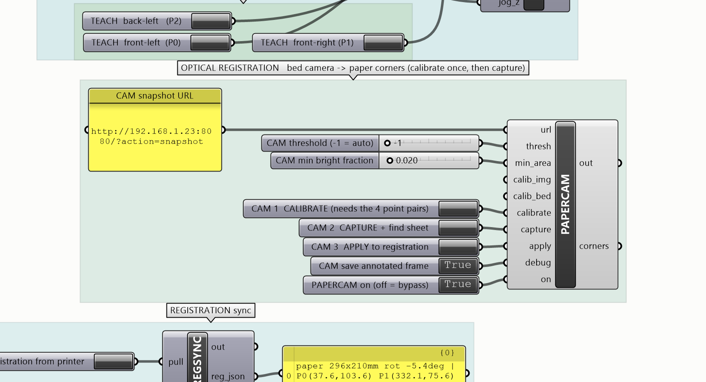
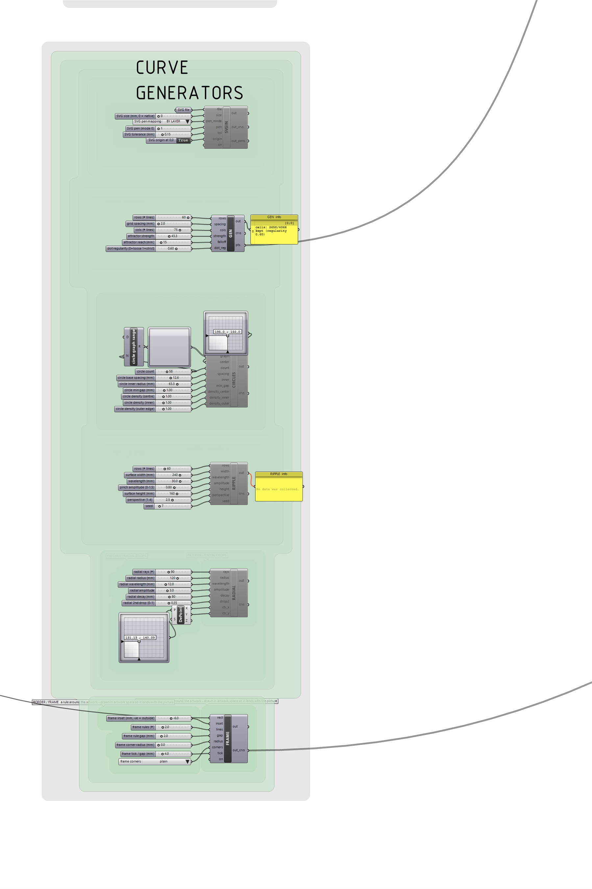
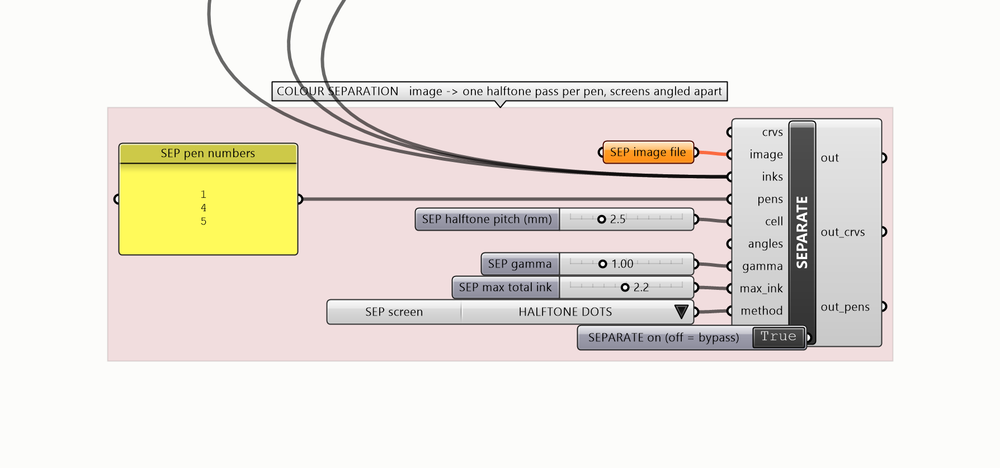
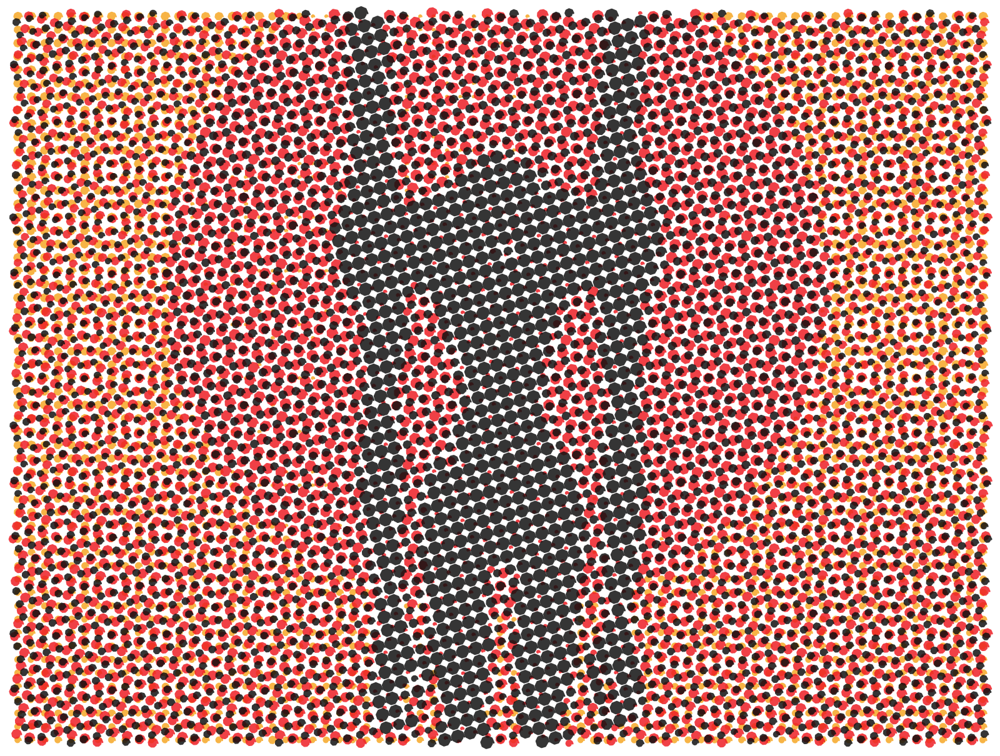

# Voron 2.4 Pen Plotter Pipeline

A pen plotter that runs on the Voron 2.4 (350) without modifying the printer:
Grasshopper generates the linework, this pipeline turns it into multi-pen
G-code, and Klipper macros handle registration, pen swaps and per-pen
calibration. The Rhino viewport is a digital twin — the bed, the registered
sheet of paper and the exact emission plan, drawn at the pen widths that will
actually lay the ink.


---

## Architecture

```
GENERATORS         PROCESSORS          LAYER TABLE      THINOUT       PLACE            GCODE            PREVIEW
mesh / lake /  ->  chained freely  ->  6 slots,     ->  drops     ->  registration ->  passes by    ->  draws the
radial / baked     curves in,          one pen #        ink the       fit / lock /     pen, ordered     actual plan,
+ DOTS ingest      curves out          each             pen can       direct bypass    travel,          8 pen colours,
                   + `on` bypass       (0 = off)        not resolve                    manifest         paper slab
                                                                          ^
                                            TITLEBLOCK ----------------- merges into GCODE as a
                                            (sizes itself to the paper)  second source after PLACE
```

Every processor shares one contract — `crvs` in, `out_crvs` out, plus an `on`
bypass — so they chain in any order. Hatch a region, dash the result, split it
through chromatic aberration onto separate pens, crop it to a shape.

### Conventions worth knowing

- **Everything is pen-space.** The whole pipeline works in physical *ink*
  positions. The pen sits **58 mm in front of the nozzle**; that offset is
  applied only when G-code text is written. Nothing upstream ever thinks about
  the nozzle.
- **Z is the pressure channel.** A curve's Z coordinate is a pressure offset in
  mm (spring pen mount, negative = press harder), emitted only when it changes.
  Because pressure rides on the geometry it survives resampling, PLACE's fit
  scaling and chaining — so stacked PRESSURE blocks *add*. `pressure_gain` on
  GCODE scales the whole channel at emission (0 = plot flat) without re-running
  anything upstream.
- **Pen palette (also the pass order):**

  | # | Pen | Width |
  |---|---|---|
  | 1 | BLACK FINE | 0.3 mm |
  | 2 | BLACK BOLD | 0.7 mm |
  | 3 | BLACK ROLLER | 0.8 mm |
  | 4 | RED FINE | 0.3 mm |
  | 5–8 | CUSTOM 1–4 | — |

  Widths live in `pen_widths.json` and do real work: they set THINOUT's culling
  distance per pen and drive the viewport preview lineweight.

---

## Canvas tour

The whole definition, left to right: hardware setup and pen calibration, then
generators, then processors and region fills, then assembly (layer table,
titleblock, placement), then G-code emission, then the preview and pen legend.


Every group is captured below at full resolution, rendered straight off the
canvas rather than screengrabbed.

### Paper registration — teaching the machine where the sheet is


Jog the pen to three corners of the sheet and press the buttons. Klipper stores
the corners in `save_variables`; the buttons pull the result straight back into
Grasshopper so the paper outline updates live in the viewport as each corner
lands. This handles a **skewed** sheet — the paper frame is derived from the
three points, so artwork is rotated to match rather than assuming square.

The jog buttons are laid out as a cross, oriented as you look down at the bed —
Y+ away from you, X+ to the right, `home` in the middle — so you press the
direction you want the head to move rather than reading a label. The TEACH
buttons sit in the same relation as the corners they teach: back-left above
front-left, front-right to its right. Same geometry for the pen trim buttons.
It is worth keeping this arrangement; a socket-ordered column is tidier on
paper and materially worse to actually use.

### Optical registration — finding the sheet with the bed camera



The same three corners, without jogging to them. The camera is fixed and the bed
is flat, so image → bed is exactly a **homography** — a plane-to-plane projective
map with 8 degrees of freedom, which absorbs the camera's tilt, offset and lens
scale into one 3×3 matrix. That is what lets a single calibration keep working:
crowsnest has autofocus off (`focus_absolute=2`), so the geometry doesn't drift
between sessions.

**Calibrate once, from marks the plotter draws itself.** `target_crvs` emits a
grid of filled discs at known machine coordinates; plot them in DIRECT placement
so they land exactly where commanded, then press CALIBRATE and it finds them and
solves.

Drawing the marks rather than sticking them on and measuring them is the whole
point: the machine already knows precisely where it put the pen, so the
coordinates are exact by construction, and the result maps the camera to
**machine coordinates** — where the toolhead actually goes — rather than to the
bed as an object. It has to be drawn marks rather than the pen tip itself,
because from overhead the toolhead hides its own tip.

With more than four marks the fit is over-determined, so the **residual per mark
becomes a real measurement** — of lens distortion, of the camera having shifted,
of a mark drawn badly — instead of the meaningless zero that four points always
produce. On a synthetic frame through a keystoned, 180°-flipped camera: 9/9
marks matched, residual mean 0.064 mm, worst 0.128 mm.

The marks are placed within X 0–350 and **Y 0–292**, because the pen sits 58 mm
in front of the nozzle and cannot reach the back strip.

**A flipped camera needs no correction.** A homography is projective, so it
absorbs 180° rotation (and any other) completely — the correspondence step finds
the grid corners regardless of orientation. Rotating in software is purely for
your own comfort in Mainsail, and if you want it, do it *before* calibrating:
any change to the camera invalidates a stored matrix.

**Then per sheet:** CAPTURE grabs a frame, picks a threshold by Otsu (paper is
far brighter than the bed), takes the convex hull of the bright region and
reduces it to the four points enclosing the most area. A sheet photographed at an
angle is a general quadrilateral rather than a rectangle, so fitting a min-area
*rectangle* would systematically clip the corners — the best-4-hull-points fit
keeps the true projected shape. APPLY writes them to `paper_registration.json` in
the same shape the manual TEACH buttons produce, so nothing downstream changes.

**Corner accuracy came from two fixes**, measured against synthetic frames with
known ground truth:

| stage | worst corner error |
|---|---|
| hull vertices of the thresholded mask | 1.3 – 1.8 mm |
| + fitting lines to the four edges | 0.63 mm |
| + bilinear sampling along the scans | **0.13 – 0.18 mm** |

The hull vertices land wherever the pixel grid happened to cross the paper, so
the edges get fitted instead: scan across each edge, find where brightness
actually crosses the threshold (interpolating between the straddling samples),
least-squares fit a line through ~40 crossings per edge, and intersect
neighbours. Sampling those scans with nearest-neighbour quantises every one to a
whole pixel and put a hard floor at 0.63 mm — bilinear removed it.

**Camera placement matters more than the algorithm.** Modelled as a pinhole
against the 350 mm bed, 1280×720:

| rig | whole bed in frame? | mm/px across the bed | corner error @0.3 px |
|---|---|---|---|
| corner mount, 60° | **no** | 0.145–0.646 (**4.5×**) | 0.04–0.19 mm |
| overhead 500 mm, 60° | no | uniform | 0.14 mm |
| overhead 560 mm, 60° | **yes** | **1.0×** | 0.15 mm |
| overhead 430 mm, 78° | yes | 1.0× | 0.16 mm |

A corner mount can't see the whole bed at a normal 60° FOV — you cannot register
a sheet that is out of frame — and its scale varies 4.5× across the bed, so
accuracy silently depends on where the paper happens to sit. Overhead gives a
uniform ~0.15 mm everywhere. With a standard 60° webcam that needs about
**560 mm** above the bed (the limit is the short axis of a 16:9 sensor); a 78°
wide-angle fits at ~430 mm. The capture reports the actual mm/px at each
detected corner, so the real figure is visible rather than assumed.

**An overhead camera looks straight through the gantry**, so the beam has to be
moved before the frame is worth anything. `PLOT_CAM_PARK` (in `cam_macros.cfg`)
sends it to the back of the bed and raises Z — and the back strip is already the
zone the pen cannot reach because of the 58 mm offset, so this costs no
printable area. It ends in `M400`, so capture only proceeds once the move has
actually finished rather than merely been queued.

> **Untested against a real camera frame.** Everything above is verified on
> synthetic frames through a simulated tilted camera. Thresholding a real bed —
> lighting, the mesh texture, glare off the sheet — is exactly the part that
> synthetic tests cannot predict, so expect the threshold and `min_area` to need
> tuning. `debug` writes an annotated frame to `screenshots/papercam_debug.png`
> showing the detected quad, which is the fastest way to see what it is latching
> onto.


The area behind the paper that the pen physically cannot reach (a consequence
of the 58 mm offset) is drawn as a red hatched exclusion zone.


### Pen tool table — per-pen XYZ datums


A CNC-style tool table. Each pen gets its own stored XYZ datum, **independent
of plot order**, so swapping a fat pen for a thin one no longer throws the
alignment out. The flow is: fit the pen at the collet position, go to the
calibration point, jog the tip onto the dot by hand, then STORE. `apply` loads
that pen's offset; `table` prints what is stored; `clear` forgets one.

**`commit` makes a mid-plot babystep permanent.** You are plotting, a pen sits
slightly high, you nudge it with the live trim — and that nudge normally dies
with the job. Commit folds it into the pen's stored datum instead. Nothing moves
when it runs: the live offset is left alone and the datum is changed by exactly
the amount that makes `PEN_APPLY` reproduce it, so committing mid-pass cannot
disturb the drawing.

Pen 1 is the exception, and deliberately so. It *is* the datum every other pen
is measured against, so a trim on pen 1 cannot be folded into the table — it
would only re-zero itself. A pen 1 height error is a global draw-height error:
change `pen_down_z` instead, or re-run STORE at the cal dot to move the datum.

### Pen control — pausing between passes


`PEN_PAUSE` holds for a pen swap and `PEN_RESUME` continues without un-retracting
— never use Klipper's stock RESUME for a pen plot, it will un-retract into the
paper. `PEN_COLLET` sends the head to the pen-fitting position.

### Pen trim — live nudges mid-plot


The babystep analogue, on all three axes. X/Y shift *where the drawing lands*;
Z is pen height. Use during a plot when a pen sits a little differently than
when it was calibrated.

### Pen widths


Store the real line weight of each pen once. THINOUT then culls automatically at
the right distance and the viewport draws at the right thickness — no manual
spacing parameter to keep in sync.


### Generators and the layer table


Pattern generators are just curve sources — baked Rhino curves work equally
well, and slot 1 is wired for exactly that.

### SVG import — artwork from anywhere



Point it at an `.svg` and it emits plotter curves with a pen number each, so the
rig draws artwork from Illustrator, Inkscape, Figma or a plotter-art library —
not only what Grasshopper generates.

It handles the parts of SVG that describe a line: every path command including
relative forms, arcs, and the smooth/shorthand curves, plus `rect` (plain and
rounded), `circle`, `ellipse`, `line`, `polyline` and `polygon`, with transforms
composed down the whole element tree. Everything is flattened to polylines
because that is what the pen draws anyway; `tol` sets how finely. Hidden
elements and `<defs>`-style template blocks are skipped, and fills are ignored —
a pen plotter draws outlines.

Pens come from one of three mappings:

| `pen_mode` | mapping |
|---|---|
| ONE PEN | everything on `pen` |
| BY LAYER | each top-level `<g>` becomes the next pen — how Illustrator and Inkscape both write layers |
| BY COLOUR | each distinct colour becomes the next pen, in the order first seen |

Colour falls back to `fill` when there is no `stroke`, and inherits down the
tree — most real artwork sets its colour once on a parent group and never
touches the paths. Only layers that actually contain geometry consume a pen
index, so a stray `<defs>` block does not shift everything by one.

### The layer table


Six slots, each assigned a pen number (0 = off). Slots are interchangeable:
any curves into any slot. The pen number, not the slot, decides which pass the
linework ends up in.

### Processors


DASH, VARIABLE DASH (ink/gap driven by length or attractor proximity),
CHROMATIC ABERRATION (splits a curve into offset colour steps across pens),
CROP (clips to any closed shape, even-odd so nested shapes cut holes), and
PRESSURE (writes the Z channel from curvature / proximity / image / noise).

### Region fills


Eight ways to fill a closed region:

| Fill | Character |
|---|---|
| HATCH | parallel lines or concentric insets (Clipper2) |
| HILBERT | space-filling curve, one continuous stroke |
| FLOW FIELD | evenly-spaced streamlines through a noise field (Jobard–Lefebvre) |
| SERPENTINE | scanlines snaked together, pen never lifts |
| TRUCHET | random arc/diagonal tiles chained into loops |
| STIPPLE / TSP | blue-noise dots, or one continuous tour through them |
| DIFFERENTIAL GROWTH | self-repelling loop folded into coral forms |
| CONTOUR | noise terrain sliced into topographic iso-lines |


### Image processors


POINTILLISM turns an image into dots — density, halftone or scattered, each dot
spiral-filled so it reads as a solid at pen width.


ASCII SHADER renders an image as drawn characters. Rather than mapping
brightness onto a ramp (which turns edges to mush), each cell is sampled into a
3×3 grid — a 9-component *shape vector* — and the character whose own ink
distribution best matches is chosen. Character vectors are measured from the
real stroke geometry, so they stay honest if the font changes. An edge running
bottom-left to top-right picks `/`; a horizontal one picks `=` or `_`. The
`edge` slider trades shape-matching against pure density.
(Technique after [alexharri.com/blog/ascii-rendering](https://alexharri.com/blog/ascii-rendering).)

Cell and glyph are compared in **absolute** terms — how much ink sits in each
region, 0–1 — with glyph coverage calibrated so the densest glyph in the set
reads as 1.0. Normalising each cell by its own peak instead seems reasonable and
is badly wrong: it discards how dark the cell is, so every smooth gradient
becomes "uniformly full" and matches whichever glyph covers all nine bins.

**Auto-levels** runs before matching. Luminance weights red at 0.299, so a
saturated red field reads as ink ≈ 0.66 despite looking bright — an image like a
red sky lands entirely at the dark end and can only reach the densest glyphs.
The ink range actually present is stretched onto 0–1 (measured inside the
image's own rect, so the white margin cannot drag the low end down), and the
range used is reported in the manifest. `gamma` still applies on top.

Characters with no glyph in the stroke font are dropped and named, rather than
silently drawing nothing.


### Colour separation — one halftone pass per pen



Each pen lays a translucent film of its own ink, so on white paper the mixing is
**subtractive**: a pen doesn't add its colour, it removes the rest. The
separation therefore works in absorption space (`absorb = 1 − colour`), where
inks laid on the same spot add together, and asks how much of each pen
reproduces the pixel:

> minimise ‖ Σᵢ xᵢ·absorbᵢ − absorb_target ‖² , with 0 ≤ xᵢ ≤ 1

solved per cell by coordinate descent. Each pen's coverage is then drawn as a
halftone dot whose **area** tracks coverage, on a grid rotated to that pen's own
screen angle — rotating the screens apart is what stops the passes forming moiré,
the same reason process printing uses 15°/75°/0°/45°.

The inks are whatever pens you actually own: the pen legend's colour swatches
wire straight into `inks`, so a black/red/amber set separates as black/red/amber
rather than pretending to be CMYK.



Two things worth knowing. **Convergence matters more than it looks**: a near-black
ink correlates with every other ink, so a few sweeps leave black over-assigned —
pure red came out 23% black. Solving properly fixes it, but only if the inks stay
in their given order. Sorting pale inks first also fixes red, and then builds
black out of red + green instead of reaching for the black pen — more ink,
muddier result. The solve is cached per quantised colour, which is what makes a
converged solve affordable.

**It is ink-hungry.** A 160 × 120 mm image at a 2.2 mm screen came to 10,198
strokes and 65 m of line across three passes. `cell`, `gamma` and `max_ink` are
the levers — `max_ink` caps total coverage per cell so the paper doesn't
saturate.

11,688 strokes over a 161×81 cell grid at 2 mm pitch, rendered at the real
0.3 mm pen width so the weight is what will land on paper. The silhouette
resolves in `o`, the sun disc behind it in `^`, and the background falls away
through `'` to `.` — eight glyphs carrying the tonal range that a single
character was carrying before.


### THINOUT — dropping ink the pen cannot resolve


Sits in the main flow (with a bypass). When strokes run closer together than the
pen is wide, the second lays ink on top of the first: no visual gain, full
plot-time cost. THINOUT walks each pen's curves — culling each pen against
*itself* only, since a red stroke beside a black one is not redundant — and
removes the portions already covered, at that pen's own stored width. Longest
strokes are processed first so the major linework survives.

On a recent dense plot: 52.25 m of ink → 46.47 m, 11% removed, no visible loss.

### Placement


Four modes: registered paper, bed-centred, direct (use the curves' actual
position in space), or driven from a graph. FIT scales artwork into the sheet;
LOCK freezes a placement so edits upstream do not shift it. The paper preview
stays visible in every mode so curves can be oriented against it.


### Titleblock


A parametric MAGI-style titleblock drawn with a **single-stroke engraving font**
(`strokefont.py`) — every glyph is drawn once, which is what a pen actually
wants. It sizes itself to the registered sheet, reserves a strip at the bottom,
and PLACE fits the artwork into what is left. Contents are live: pen names,
estimated duration, scale, date. Two dropdowns pick which pens draw it.


### GCODE and the manifest


Sampling, per-pen passes, travel ordering, welding, the signature, the bounding
box mime, and the manifest. Read the manifest before pressing PLOT — it refuses
to run if the plot falls outside the paper or the machine.

```
JOB: 3 pass(es) | est 14.2 min (draw 8.3m, travel 4.1m)
placement: REGISTERED paper, FIT scale 0.54
PASS 1 - pen 1 [BLACK FINE]:  456 strokes (3.3m)
PASS 2 - pen 2 [BLACK BOLD]: 2284 strokes (4.7m)
PASS 3 - pen 4 [RED FINE]:    102 strokes (0.3m)
speeds: Normal (draw 3000 / travel 6000 / accel 3000)
welded 13 touching stroke ends (13 pen lifts saved)
pen 1: 2-opt: 97 reversals, travel 1.28m -> 0.82m (36% less pen-up)
pen 2: 2-opt skipped (would cost ~5.0s of solve to save ~2.9s of plotting)
pen 4: 2-opt: 17 reversals, travel 0.53m -> 0.48m (10% less pen-up)
```

### Preview and pen legend


PREVIEW draws the emission plan itself rather than the upstream geometry, so
what you see is what the machine will do. The legend assigns each pen its
viewport colour and — via the Custom Preview Lineweights — its real width, so
a 0.8 mm roller looks like a 0.8 mm roller on screen.


---

## Things that took a while to get right

- **Adaptive bed mesh.** The plot's bounding box is emitted as an
  `EXCLUDE_OBJECT_DEFINE` polygon before `BED_MESH_CALIBRATE ADAPTIVE=1`, so
  KAMP probes only the paper — not the whole 350 mm bed.
- **Conditional homing/QGL.** `PLOT_HOME_QGL` skips both if they have already
  run, so a pen swap does not re-level.
- **Welding.** Curves that are separate objects in Rhino but touch end-to-end
  were causing a pen lift per segment. Ends within `weld` distance are merged
  into one stroke.
- **Travel ordering is spatially indexed.** Greedy nearest-end ordering scanned
  every remaining stroke each step — O(n²). At 11,826 strokes that was ~70
  million distance tests and **670 seconds** of solve. Endpoints now go into a
  grid searched ring-by-ring, stopping once the ring's inner edge is further
  than the best candidate found: **10.7 s**, identical result (travel 24.8 m →
  11.6 m either way).
- **2-opt only runs where it pays.** After greedy, reversing a run of strokes
  can shorten the route further — and because reversing a run also flips each
  stroke's direction, every link *inside* it keeps its length, so a move costs
  only its two boundary links. But greedy already takes the nearest free
  endpoint, so on tightly packed work there is nothing left: measured on 2,284
  glyph strokes (median link 0.97 mm) it bought 5.5% for 5 s of solve to save
  1.6 s of plotting — a net loss. On 286 sparse strokes (median link 2.91 mm)
  it bought 14.6% for 0.5 s. So it estimates the payoff first and skips itself
  when the arithmetic doesn't work, reporting either way in the manifest.
  Splitting passes per pen helps here: each pass is sparser than the whole job,
  so a dense pass gets skipped while sparse ones see 10–36%.
- **`Curve.LengthParameter` costs ~680 µs a call.** It solves for arc length
  every time. VARDASH asked for it ~10,000 times per solve — 7 of its 11.6
  seconds. Each curve is now sampled once into an arc-length table and looked up
  by binary search: **11.6 s → 0.4 s**, with Z interpolated so the pressure
  channel survives untouched.
- **The ASCII shader was picking one character for the entire image.** Two
  independent causes, both invisible in a synthetic test: normalising each cell
  by its own peak discarded density (so everything matched `o`), and the red-
  heavy source never reached the light end of the charset. Fixed by absolute
  coverage matching plus auto-levels. Resampling the image onto the region grid
  with GDI+ instead of 4 subsamples per region took it **12.7 s → 6.0 s**.
- **Small closed curves plotted as triangles.** `DivideByLength` collapsed them
  to three points. There is now a segment-count floor for short/closed curves.
- **The pen offset was measured, not assumed.** A 4-point bed measurement found
  the real offset was 10 mm off nominal — every plot before that was wrong by
  10 mm. Re-measure after any toolhead change.

---

## Files

| File | What |
|---|---|
| `plotter.gh` | The Grasshopper definition (all canvas UI) |
| `plotter_workspace.3dm` | Rhino workspace, bed model aligned to physical coords |
| `place_component.py` | PLACE: art → paper mapping, FIT/1:1, LOCK, DIRECT bypass |
| `gcode_component.py` | GCODE: sampling, passes, ordering, welding, manifest, emission |
| `preview_component.py` | PREVIEW: display shell (plan geometry drawn raw) |
| `thinout_component.py` | THINOUT: per-pen culling of unresolvable linework |
| `titleblock_component.py` | TITLEBLOCK: parametric block, auto-sized to the sheet |
| `strokefont.py` | Single-stroke engraving font (A–Z 0–9 + punctuation) |
| `paperreg_component.py` | PAPER REGISTRATION: teach/pull the three corners |
| `pencal_component.py` | PEN TOOL TABLE: per-pen XYZ datums |
| `pentrim_component.py` | PEN TRIM: live X/Y/Z nudges mid-plot |
| `penwidth_component.py` | PEN WIDTHS: line weight per pen |
| `centre_component.py` | CENTRE: recentre artwork on the sheet |
| `crop_component.py` | CROP: clip to closed shapes, even-odd |
| `dash_component.py` | DASH (also the template for new processor blocks) |
| `vardash_component.py` | VARIABLE DASH: ink/gap by length or attractor |
| `ca_component.py` | CHROMATIC ABERRATION: 6 offset colour steps |
| `pressure_component.py` | PRESSURE: writes the Z pressure channel |
| `hatch_component.py` | HATCH fill: parallel lines / concentric insets |
| `hilbert_component.py` | HILBERT fill |
| `flowfield_component.py` | FLOW FIELD fill |
| `serpentine_component.py` | SERPENTINE fill |
| `truchet_component.py` | TRUCHET fill |
| `stipple_component.py` | STIPPLE / TSP-ART |
| `growth_component.py` | DIFFERENTIAL GROWTH |
| `contour_component.py` | CONTOUR / iso-lines |
| `circles_component.py` | CONCENTRIC CIRCLES (Graph Mapper spacing) |
| `pointillism_component.py` | POINTILLISM: image → spiral-filled dots |
| `ascii_component.py` | ASCII SHADER: image → shape-matched characters |
| `svg_component.py` | SVG IMPORT: any `.svg` → pen-assigned curves |
| `separation_component.py` | COLOUR SEPARATION: image → one halftone pass per pen |
| `papercam_component.py` | PAPERCAM: bed camera → paper corners (homography + edge fit) |
| `camera_calibration.json` | Stored image→bed homography (written by CALIBRATE) |
| `pen_commit_macros.cfg` | `PEN_COMMIT` / `PEN_TWEAK` — append to the printer's `pen_macros.cfg` |
| `pen_widths.json` | Line weight per pen |
| `paper_registration.json` | Last taught paper corners (also on the printer) |
| `titleblock_brief.md` | Design brief the titleblock SVG was generated from |
| `hardware/pen_mount/*.stl` | Printable parts for the pen mount (see below) |

---

## Pen mount

The thing all of the above actually drives. STLs are in
[`hardware/pen_mount/`](hardware/pen_mount).

It is **specific to the Archetype toolhead** — it is not a general-purpose
adapter, and it will not fit a stock Stealthburner or a Dragon Burner without
rework. It mounts in place of the extruder.

**Magnetic quick release.** The pen carrier is held on magnetically, so a pen
change is a pull and a push rather than screws. This matters more than it
sounds: a plot with four pens stops four times, and any fastener that needs a
tool turns each of those pauses into a chance to nudge the machine. The
tradeoff is that the mount is only as repeatable as the magnets seat it — see
the note on datums below.

**Linear bearing from the Voron TAP system.** The carriage rides the same rail
and bearing TAP uses, which is the point: it is a known-good, widely available
part with no play in the direction that matters, and most Voron owners either
have one or can get one. The pen carrier travels vertically on it.

**Sprung on the rail.** Pen springs sit on the rail so the pen floats under
constant force rather than being driven to a hard Z. The pen tracks paper that
is not perfectly flat, and a small Z error becomes a small pressure change
instead of a crash or a skipped line. `pen_down_z` sets nominal contact and the
spring absorbs the rest.

The spring is the reason for the `preload` parameter in the GCODE component:
at draw height the tip is pressed roughly 1 mm into the paper by spring
compression. **Travel hop must exceed the preload**, or the pen never actually
leaves the page. Running a 1.5 mm hop against 1.01 mm of preload leaves ~0.5 mm
of real clearance, and the pen drags a visible line through every travel move —
which is exactly what happened, and it corrupted the middle column of every
camera calibration for days before it was spotted. 4 mm is a sane hop.

**Self-centering collet.** The pen is gripped by a collet, so pens of different
barrel diameters land on the same axis instead of leaning to whichever side the
clamp pushes them. Without this, every pen change is also a lateral datum
change, and the tool table cannot help — it stores an offset per pen, not per
insertion.

**Frog face on top.** No function. It is a small frog. It is on top.

### Datums and the mount

The tool table stores an XYZ datum per pen, measured by touching the tip to the
calibration dot. That corrects for pens being different lengths and sitting at
different depths — but it stores one offset per *pen*, not per *insertion*.
Anything that changes between insertions of the same pen is not corrected, so
the mount's job is to make re-seating repeatable enough that it does not need
to be. Measured across a pen-out / home / QGL / pen-in cycle, the same pen
returned to within **0.6 mm**.

Pen 1 is the datum every other pen is measured against, so a pen 1 re-seat
shifts everything with nothing to compensate. If absolute position matters,
re-touch the dot after fitting pen 1.

### Printing the parts

Exported from Rhino, so the filenames are export order rather than anything
meaningful. Sizes are the bounding box:

| File | Triangles | Bounding box (mm) |
|---|---|---|
| `Green_001.stl` | 3,020 | 34.3 × 17.7 × 68.8 |
| `Green_002.stl` | 4,428 | 35.0 × 17.0 × 30.0 |
| `Green_003.stl` | 502 | 8.4 × 14.6 × 14.5 |
| `Green_004.stl` | 502 | 8.4 × 14.6 × 14.5 |
| `Green_005.stl` | 15,580 | 33.1 × 33.1 × 22.7 |
| `Green_006.stl` | 2,700 | 22.5 × 22.5 × 30.6 |
| `Green_007.stl` | 10,048 | 35.0 × 36.9 × 30.0 |
| `Green_008.stl` | 32,378 | 35.0 × 36.9 × 30.0 |

`Green_003` and `Green_004` are identical — print two. `Green_007` and
`Green_008` occupy the same bounding box at very different triangle counts, so
they are a plain and a detailed variant of the same part rather than two
different parts; print one.

---

## Printer-side macros (`pen_macros.cfg` in this repo's config)

| Macro | What |
|---|---|
| `PEN_PAUSE COLOR=` | Pen swap without parking; prompts for the named pen |
| `PEN_RESUME` | Resume with no un-retract — **never use stock RESUME for pen plots** |
| `PEN_RESTORE_LIMITS` | Put velocity/accel limits back after a plot |
| `PLOT_HOME_QGL` | Conditional home + QGL (skips if already done) |
| `PAPER_SET_FL/FR/BL` | Teach a paper corner, persisted via `save_variables` |
| `PEN_COLLET` | Move to the pen-fitting position |
| `PEN_CAL_POS` | Move to the calibration dot (nozzle coords) |
| `PEN_CALIBRATE` | Store the current position as this pen's datum |
| `PEN_APPLY PEN=n` | Load pen n's stored offset |
| `PEN_COMMIT PEN=n` | Fold the live trim into pen n's datum (nothing moves) |
| `PEN_TWEAK PEN=n Z=-0.2` | Adjust a stored datum after the fact |
| `PEN_TABLE` | Print the stored table |
| `PEN_CLEAR_CAL PEN=n` | Forget pen n |

`PEN_COMMIT` and `PEN_TWEAK` are staged in `pen_commit_macros.cfg` — append them
to `pen_macros.cfg` on the printer. They assume `PEN_APPLY` sets the offset to
`pen_cal_N - pen_cal_1`; if it computes it differently, only the three
`ax/ay/az` lines in `PEN_COMMIT` need to change.

---

## Plot workflow

1. **Paper down.** If it moved: jog the pen to three corners → `PAPER_SET_FL`,
   `FR`, `BL` → the paper outline updates live in Rhino.
2. **Calibrate any uncalibrated pen** (once per pen, not per plot): CAL 1 fit at
   the collet → CAL 2 go to the cal point → jog the tip onto the dot → CAL 3
   STORE.
3. **Read the JOB MANIFEST.** Passes, time, warnings. PLOT refuses if out of
   bounds.
4. **Press PLOT.** It uploads and starts. The machine homes/QGLs only if
   needed, probes just the paper, then traces the plot bounding box slowly as an
   alignment check before committing ink.
5. **Seat each pen.** It presents just off the paper edge; seat the pen to the
   bed surface, tighten, `PEN_RESUME`. Repeat per pass — the display names the
   pen to load. Pen-change dots always land outside the paper margins.
   If a pen needs a nudge once it is drawing, trim it live — and press `commit`
   so you do not have to make the same nudge next time.
6. **End of plot** parks centred in X toward the back, steppers left on, so the
   paper can be lifted off cleanly.

---

## History

Built pair-programming with Claude over a Rhino MCP bridge (Keratin) driving the
Grasshopper canvas programmatically — components authored, wired, laid out and
debugged in-session, alongside the Klipper macros, registration system and
calibration procedures.
