# Voron 2.4 Pen Plotter Pipeline

A pen plotter that runs on the Voron 2.4 (350) without modifying the printer:
Grasshopper generates the linework, this pipeline turns it into multi-pen
G-code, and Klipper macros handle registration, pen swaps and per-pen
calibration. The Rhino viewport is a digital twin — the bed, the registered
sheet of paper and the exact emission plan, drawn at the pen widths that will
actually lay the ink.

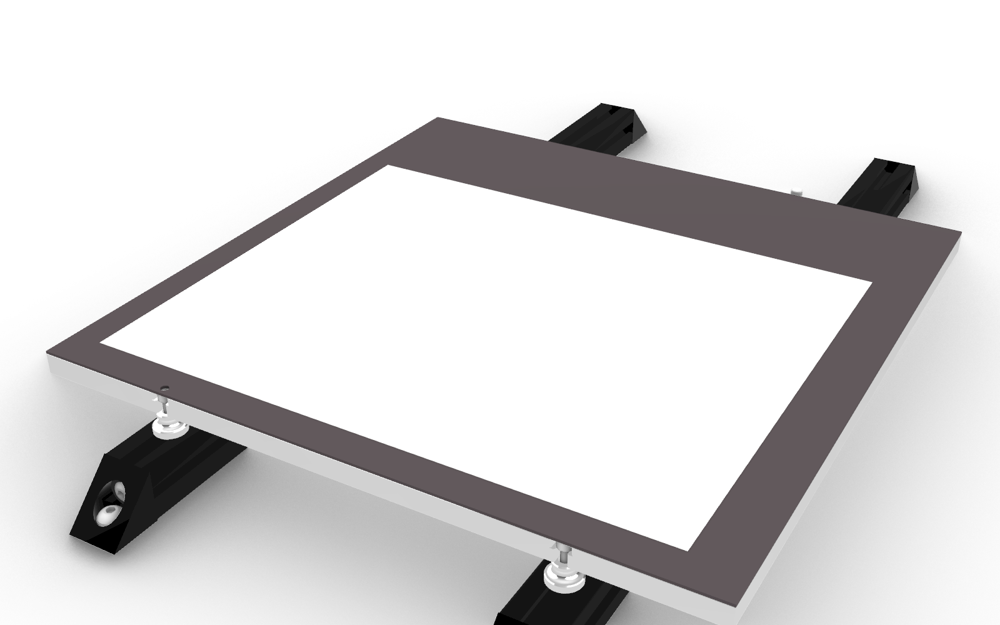

---

## Architecture

```
GENERATORS         PROCESSORS          LAYER TABLE      THINOUT       PLACE            GCODE            PREVIEW
mesh / lake /  ->  chained freely  ->  6 slots,     ->  drops     ->  registration ->  passes by    ->  draws the
radial / baked     curves in,          one pen #        ink the       fit / lock /     pen, ordered     actual plan,
+ DOTS ingest      curves out          each             pen can       direct bypass    travel,          8 pen colours,
                   + `on` bypass       (0 = off)        not resolve                    manifest         paper slab
                                                                          ^
                                            TITLEBLOCK ----------------- merges into GCODE as a
                                            (sizes itself to the paper)  second source after PLACE
```

Every processor shares one contract — `crvs` in, `out_crvs` out, plus an `on`
bypass — so they chain in any order. Hatch a region, dash the result, split it
through chromatic aberration onto separate pens, crop it to a shape.

### Conventions worth knowing

- **Everything is pen-space.** The whole pipeline works in physical *ink*
  positions. The pen sits **58 mm in front of the nozzle**; that offset is
  applied only when G-code text is written. Nothing upstream ever thinks about
  the nozzle.
- **Z is the pressure channel.** A curve's Z coordinate is a pressure offset in
  mm (spring pen mount, negative = press harder), emitted only when it changes.
  Because pressure rides on the geometry it survives resampling, PLACE's fit
  scaling and chaining — so stacked PRESSURE blocks *add*. `pressure_gain` on
  GCODE scales the whole channel at emission (0 = plot flat) without re-running
  anything upstream.
- **Pen palette (also the pass order):**

  | # | Pen | Width |
  |---|---|---|
  | 1 | BLACK FINE | 0.3 mm |
  | 2 | BLACK BOLD | 0.7 mm |
  | 3 | BLACK ROLLER | 0.8 mm |
  | 4 | RED FINE | 0.3 mm |
  | 5–8 | CUSTOM 1–4 | — |

  Widths live in `pen_widths.json` and do real work: they set THINOUT's culling
  distance per pen and drive the viewport preview lineweight.

---

## Canvas tour

The whole definition, left to right: hardware setup and pen calibration, then
generators, then processors and region fills, then assembly (layer table,
titleblock, placement), then G-code emission, then the preview and pen legend.

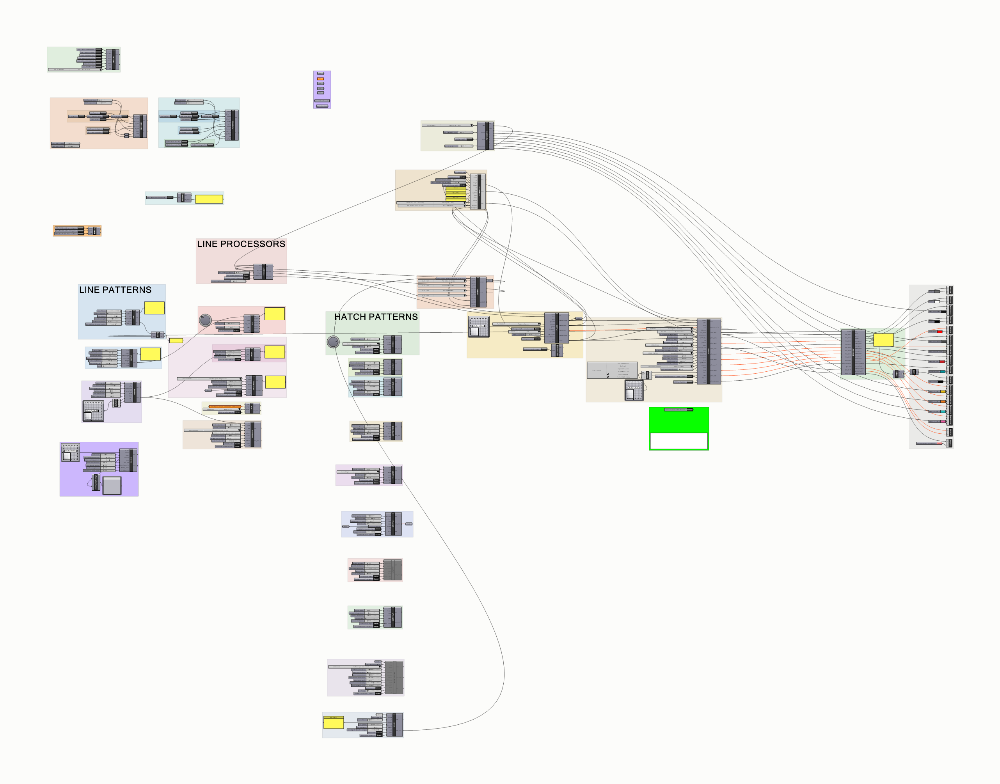

Every group is captured below at full resolution, rendered straight off the
canvas rather than screengrabbed.

### Paper registration — teaching the machine where the sheet is

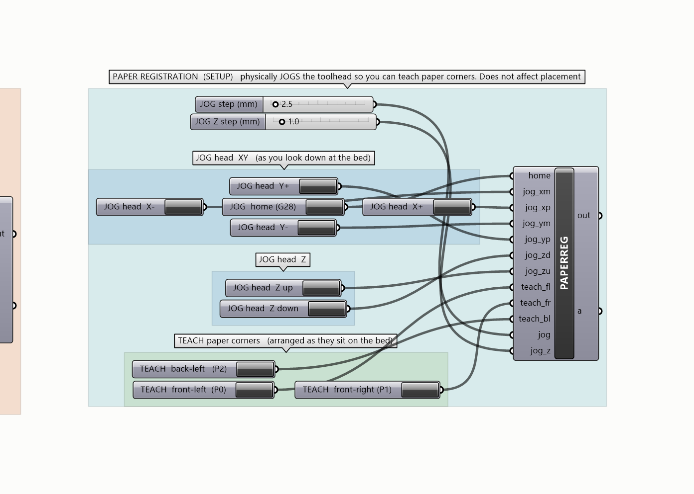

Jog the pen to three corners of the sheet and press the buttons. Klipper stores
the corners in `save_variables`; the buttons pull the result straight back into
Grasshopper so the paper outline updates live in the viewport as each corner
lands. This handles a **skewed** sheet — the paper frame is derived from the
three points, so artwork is rotated to match rather than assuming square.

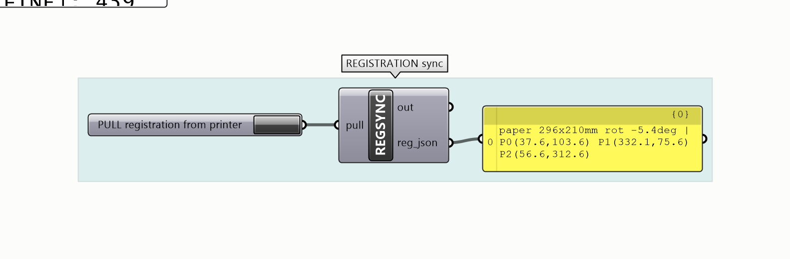

The area behind the paper that the pen physically cannot reach (a consequence
of the 58 mm offset) is drawn as a red hatched exclusion zone.

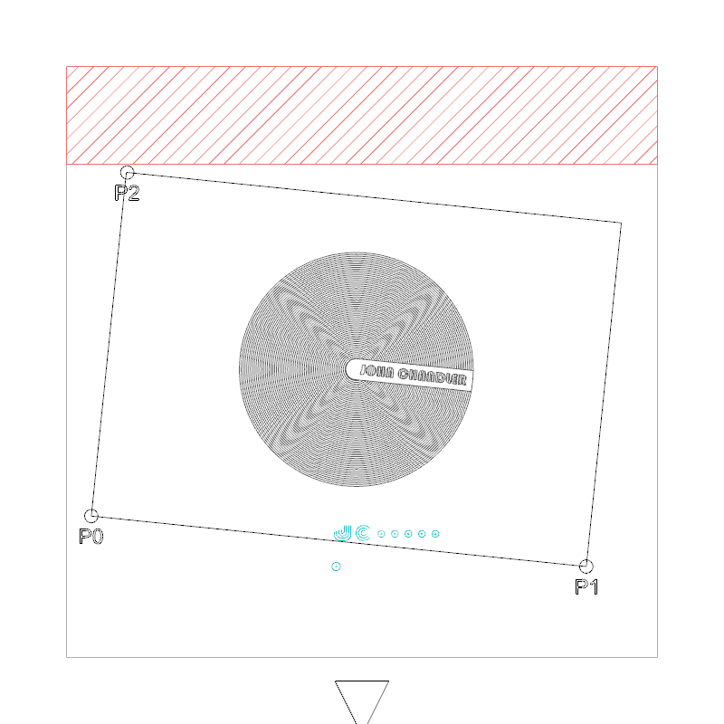

### Pen tool table — per-pen XYZ datums

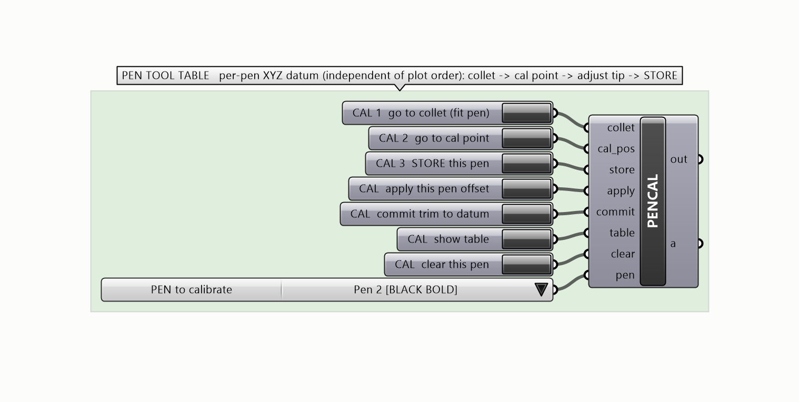

A CNC-style tool table. Each pen gets its own stored XYZ datum, **independent
of plot order**, so swapping a fat pen for a thin one no longer throws the
alignment out. The flow is: fit the pen at the collet position, go to the
calibration point, jog the tip onto the dot by hand, then STORE. `apply` loads
that pen's offset; `table` prints what is stored; `clear` forgets one.

**`commit` makes a mid-plot babystep permanent.** You are plotting, a pen sits
slightly high, you nudge it with the live trim — and that nudge normally dies
with the job. Commit folds it into the pen's stored datum instead. Nothing moves
when it runs: the live offset is left alone and the datum is changed by exactly
the amount that makes `PEN_APPLY` reproduce it, so committing mid-pass cannot
disturb the drawing.

Pen 1 is the exception, and deliberately so. It *is* the datum every other pen
is measured against, so a trim on pen 1 cannot be folded into the table — it
would only re-zero itself. A pen 1 height error is a global draw-height error:
change `pen_down_z` instead, or re-run STORE at the cal dot to move the datum.

### Pen control — pausing between passes

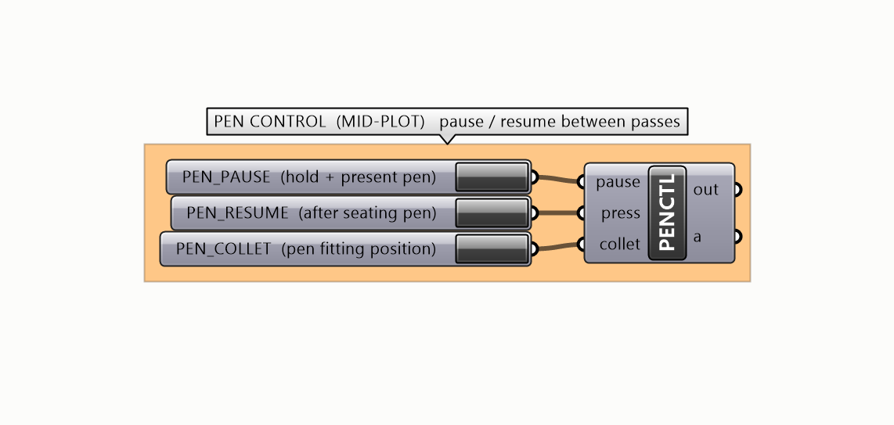

`PEN_PAUSE` holds for a pen swap and `PEN_RESUME` continues without un-retracting
— never use Klipper's stock RESUME for a pen plot, it will un-retract into the
paper. `PEN_COLLET` sends the head to the pen-fitting position.

### Pen trim — live nudges mid-plot

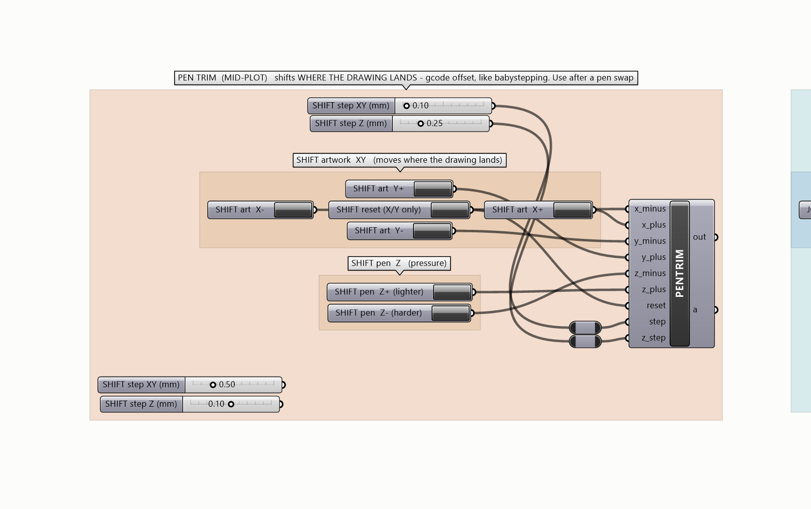

The babystep analogue, on all three axes. X/Y shift *where the drawing lands*;
Z is pen height. Use during a plot when a pen sits a little differently than
when it was calibrated.

### Pen widths

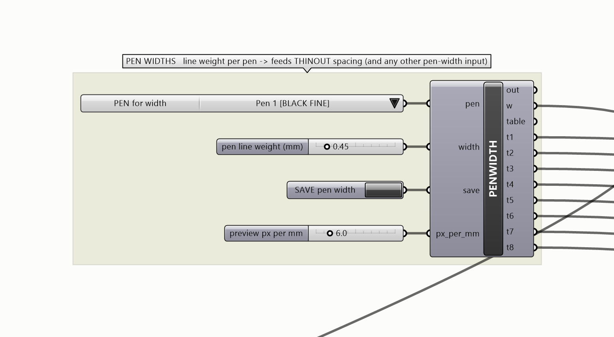

Store the real line weight of each pen once. THINOUT then culls automatically at
the right distance and the viewport draws at the right thickness — no manual
spacing parameter to keep in sync.

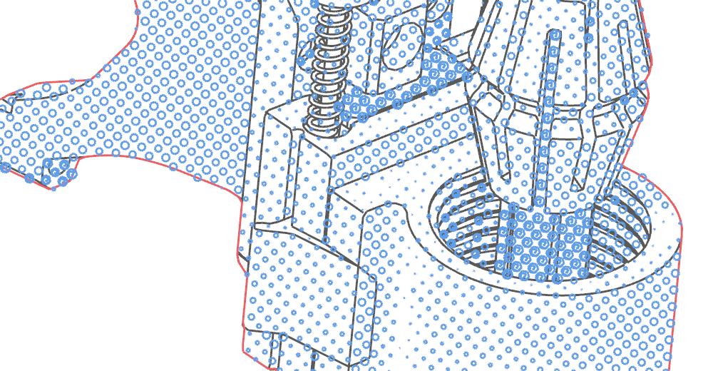

### Generators and the layer table

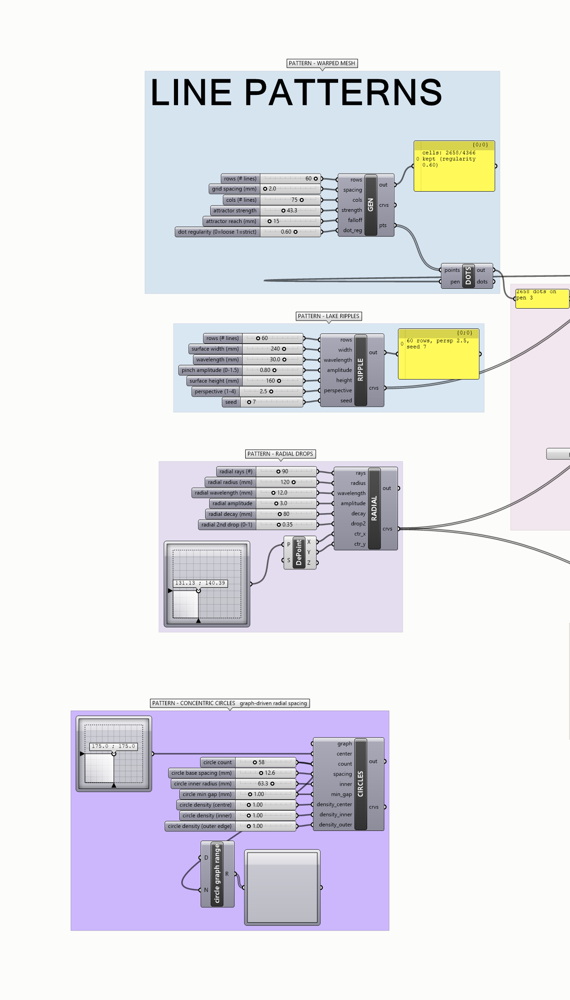

Pattern generators are just curve sources — baked Rhino curves work equally
well, and slot 1 is wired for exactly that.

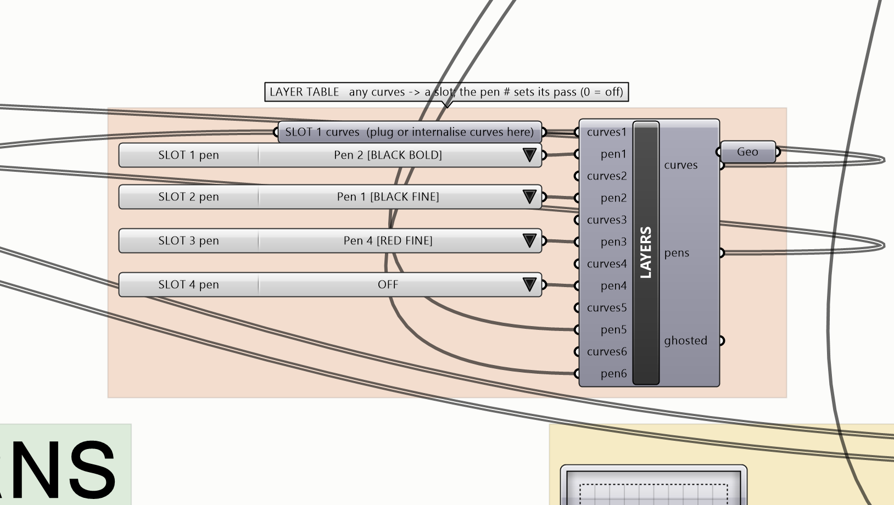

Six slots, each assigned a pen number (0 = off). Slots are interchangeable:
any curves into any slot. The pen number, not the slot, decides which pass the
linework ends up in.

### Processors

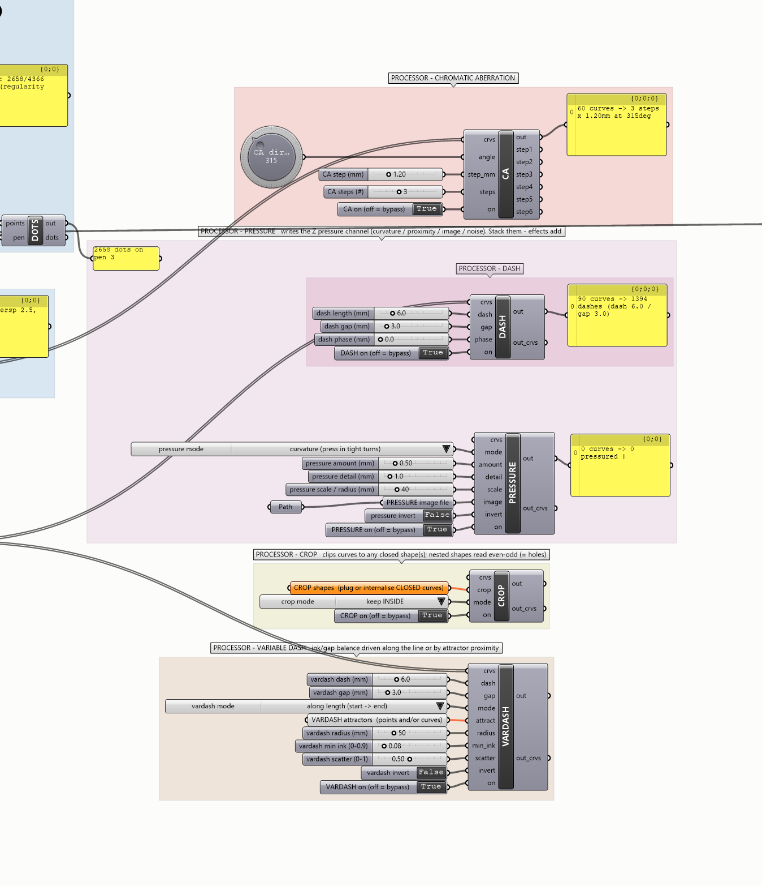

DASH, VARIABLE DASH (ink/gap driven by length or attractor proximity),
CHROMATIC ABERRATION (splits a curve into offset colour steps across pens),
CROP (clips to any closed shape, even-odd so nested shapes cut holes), and
PRESSURE (writes the Z channel from curvature / proximity / image / noise).

### Region fills

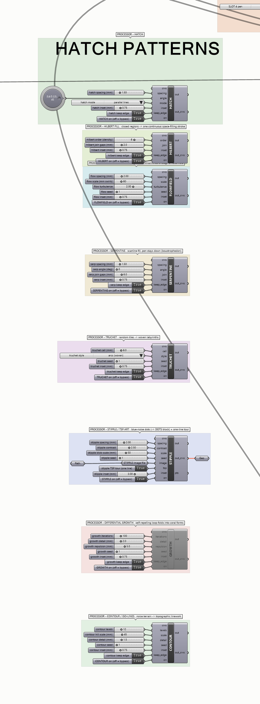

Eight ways to fill a closed region:

| Fill | Character |
|---|---|
| HATCH | parallel lines or concentric insets (Clipper2) |
| HILBERT | space-filling curve, one continuous stroke |
| FLOW FIELD | evenly-spaced streamlines through a noise field (Jobard–Lefebvre) |
| SERPENTINE | scanlines snaked together, pen never lifts |
| TRUCHET | random arc/diagonal tiles chained into loops |
| STIPPLE / TSP | blue-noise dots, or one continuous tour through them |
| DIFFERENTIAL GROWTH | self-repelling loop folded into coral forms |
| CONTOUR | noise terrain sliced into topographic iso-lines |


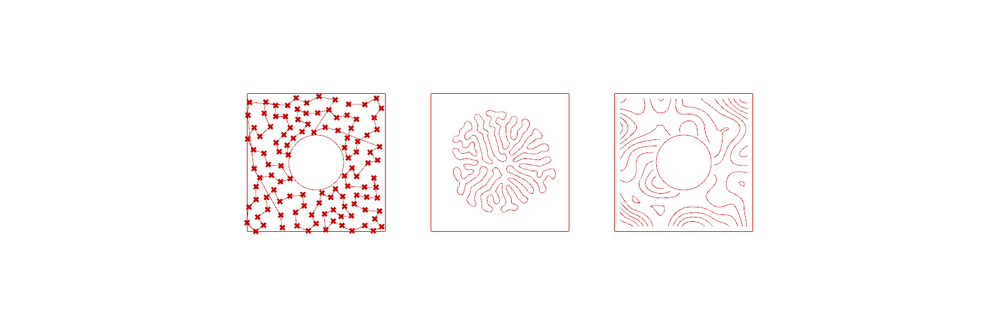

### Image processors

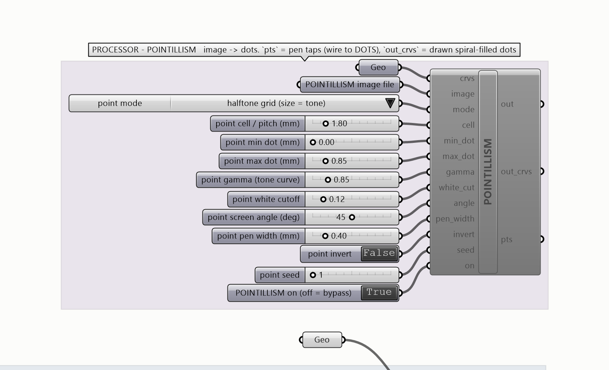

POINTILLISM turns an image into dots — density, halftone or scattered, each dot
spiral-filled so it reads as a solid at pen width.

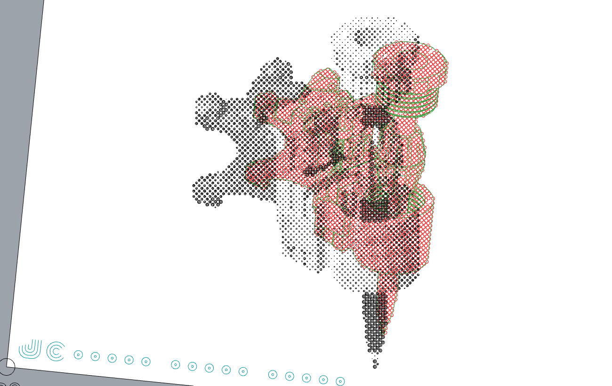

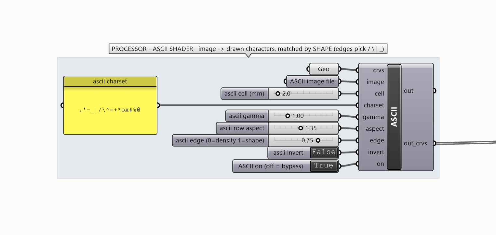

ASCII SHADER renders an image as drawn characters. Rather than mapping
brightness onto a ramp (which turns edges to mush), each cell is sampled into a
3×3 grid — a 9-component *shape vector* — and the character whose own ink
distribution best matches is chosen. Character vectors are measured from the
real stroke geometry, so they stay honest if the font changes. An edge running
bottom-left to top-right picks `/`; a horizontal one picks `=` or `_`. The
`edge` slider trades shape-matching against pure density.
(Technique after [alexharri.com/blog/ascii-rendering](https://alexharri.com/blog/ascii-rendering).)

Cell and glyph are compared in **absolute** terms — how much ink sits in each
region, 0–1 — with glyph coverage calibrated so the densest glyph in the set
reads as 1.0. Normalising each cell by its own peak instead seems reasonable and
is badly wrong: it discards how dark the cell is, so every smooth gradient
becomes "uniformly full" and matches whichever glyph covers all nine bins.

**Auto-levels** runs before matching. Luminance weights red at 0.299, so a
saturated red field reads as ink ≈ 0.66 despite looking bright — an image like a
red sky lands entirely at the dark end and can only reach the densest glyphs.
The ink range actually present is stretched onto 0–1 (measured inside the
image's own rect, so the white margin cannot drag the low end down), and the
range used is reported in the manifest. `gamma` still applies on top.

Characters with no glyph in the stroke font are dropped and named, rather than
silently drawing nothing.

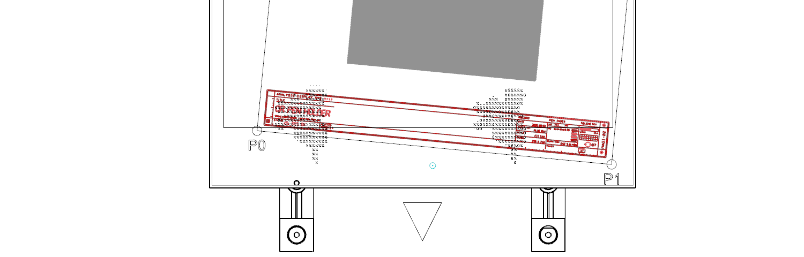

11,688 strokes over a 161×81 cell grid at 2 mm pitch, rendered at the real
0.3 mm pen width so the weight is what will land on paper. The silhouette
resolves in `o`, the sun disc behind it in `^`, and the background falls away
through `'` to `.` — eight glyphs carrying the tonal range that a single
character was carrying before.

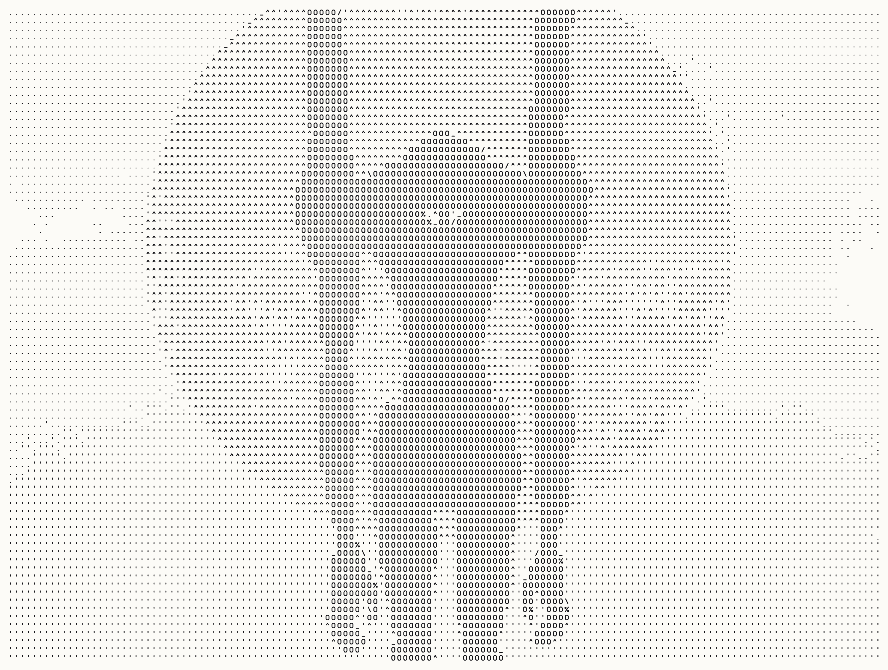

### THINOUT — dropping ink the pen cannot resolve

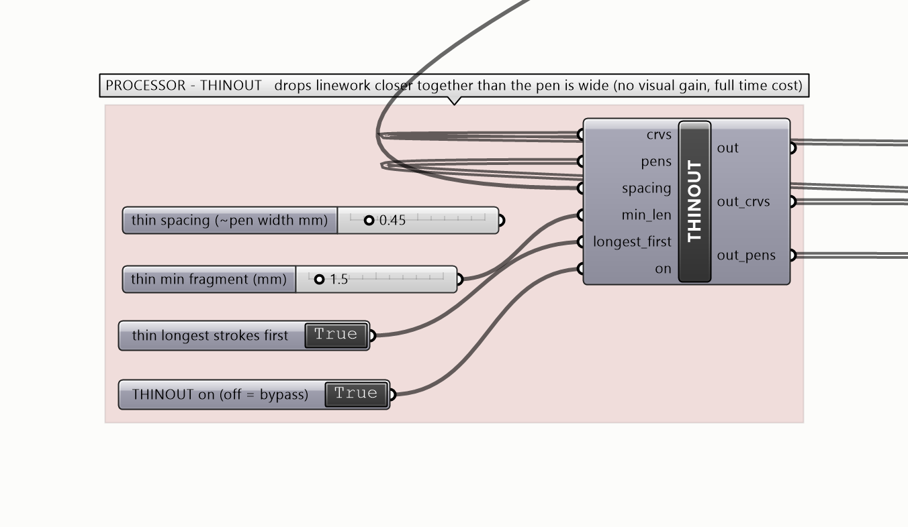

Sits in the main flow (with a bypass). When strokes run closer together than the
pen is wide, the second lays ink on top of the first: no visual gain, full
plot-time cost. THINOUT walks each pen's curves — culling each pen against
*itself* only, since a red stroke beside a black one is not redundant — and
removes the portions already covered, at that pen's own stored width. Longest
strokes are processed first so the major linework survives.

On a recent dense plot: 52.25 m of ink → 46.47 m, 11% removed, no visible loss.

### Placement

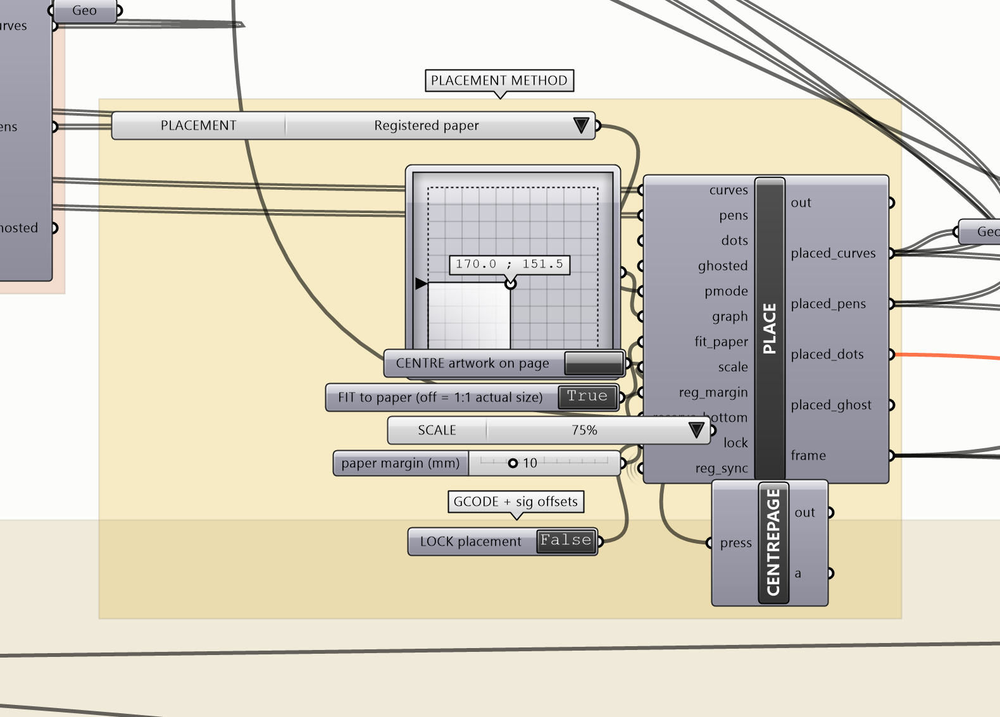

Four modes: registered paper, bed-centred, direct (use the curves' actual
position in space), or driven from a graph. FIT scales artwork into the sheet;
LOCK freezes a placement so edits upstream do not shift it. The paper preview
stays visible in every mode so curves can be oriented against it.

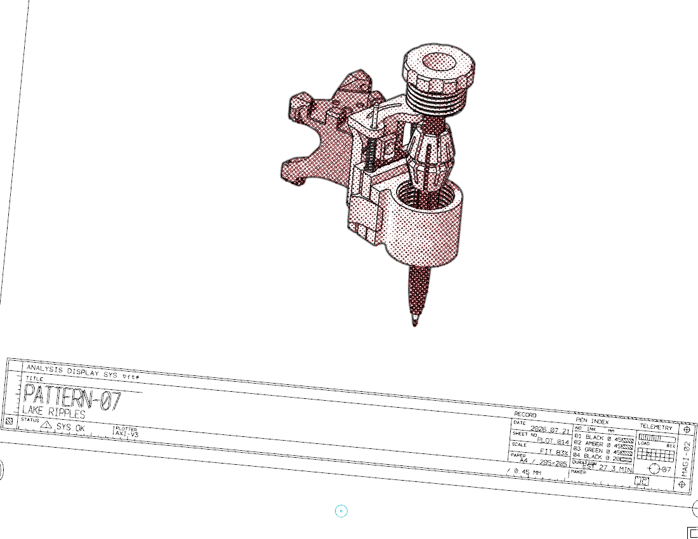

### Titleblock

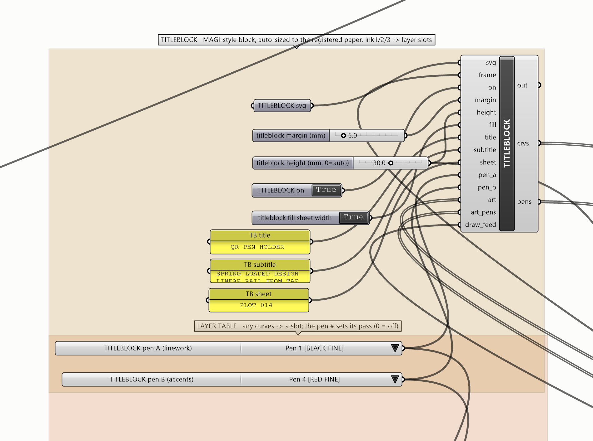

A parametric MAGI-style titleblock drawn with a **single-stroke engraving font**
(`strokefont.py`) — every glyph is drawn once, which is what a pen actually
wants. It sizes itself to the registered sheet, reserves a strip at the bottom,
and PLACE fits the artwork into what is left. Contents are live: pen names,
estimated duration, scale, date. Two dropdowns pick which pens draw it.

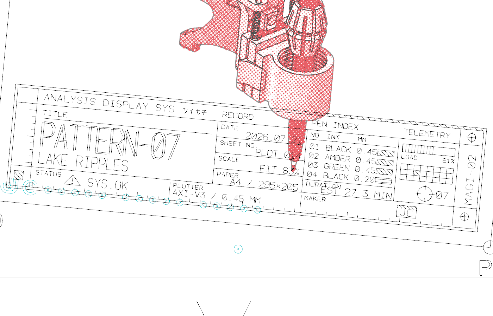

### GCODE and the manifest

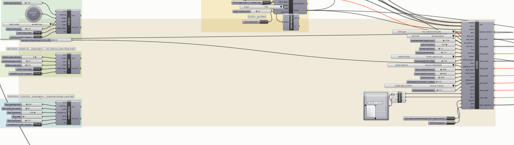

Sampling, per-pen passes, travel ordering, welding, the signature, the bounding
box mime, and the manifest. Read the manifest before pressing PLOT — it refuses
to run if the plot falls outside the paper or the machine.

```
JOB: 3 pass(es) | est 54.1 min (draw 28.0m, travel 13.4m)
placement: REGISTERED paper, FIT scale 0.54
PASS 1 - pen 1 [BLACK FINE]:   459 strokes (3.3m)
PASS 2 - pen 2 [BLACK BOLD]: 11826 strokes (24.4m)
PASS 3 - pen 4 [RED FINE]:     102 strokes (0.3m)
speeds: Normal (draw 3000 / travel 6000 / accel 3000)
welded 12 touching stroke ends (12 pen lifts saved)
```

### Preview and pen legend

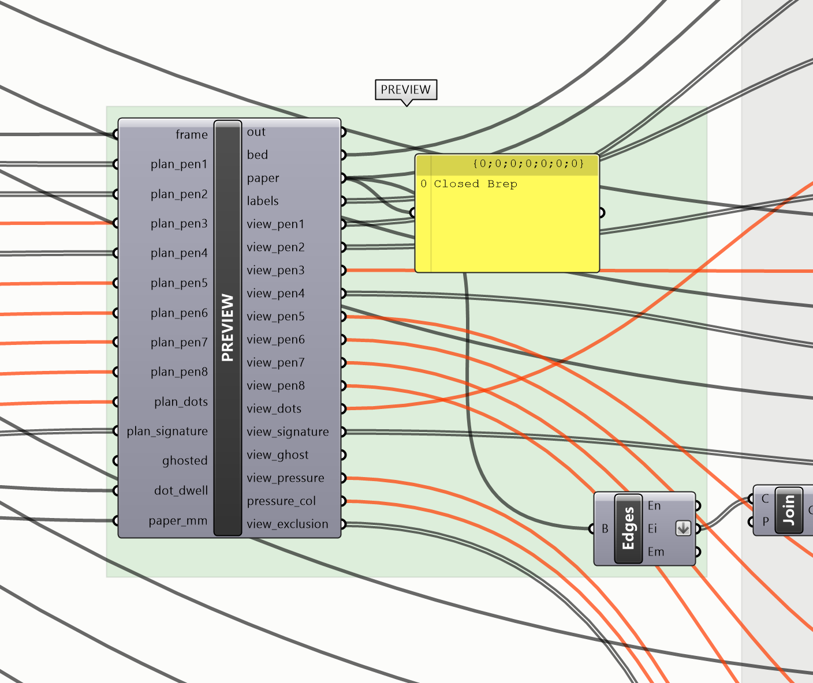

PREVIEW draws the emission plan itself rather than the upstream geometry, so
what you see is what the machine will do. The legend assigns each pen its
viewport colour and — via the Custom Preview Lineweights — its real width, so
a 0.8 mm roller looks like a 0.8 mm roller on screen.

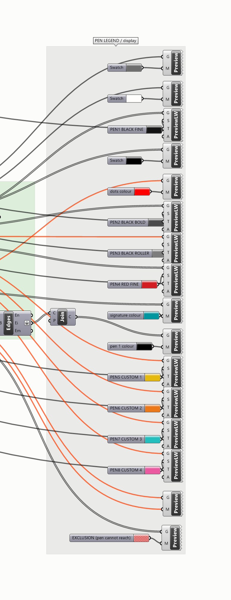

---

## Things that took a while to get right

- **Adaptive bed mesh.** The plot's bounding box is emitted as an
  `EXCLUDE_OBJECT_DEFINE` polygon before `BED_MESH_CALIBRATE ADAPTIVE=1`, so
  KAMP probes only the paper — not the whole 350 mm bed.
- **Conditional homing/QGL.** `PLOT_HOME_QGL` skips both if they have already
  run, so a pen swap does not re-level.
- **Welding.** Curves that are separate objects in Rhino but touch end-to-end
  were causing a pen lift per segment. Ends within `weld` distance are merged
  into one stroke.
- **Travel ordering is spatially indexed.** Greedy nearest-end ordering scanned
  every remaining stroke each step — O(n²). At 11,826 strokes that was ~70
  million distance tests and **670 seconds** of solve. Endpoints now go into a
  grid searched ring-by-ring, stopping once the ring's inner edge is further
  than the best candidate found: **10.7 s**, identical result (travel 24.8 m →
  11.6 m either way).
- **`Curve.LengthParameter` costs ~680 µs a call.** It solves for arc length
  every time. VARDASH asked for it ~10,000 times per solve — 7 of its 11.6
  seconds. Each curve is now sampled once into an arc-length table and looked up
  by binary search: **11.6 s → 0.4 s**, with Z interpolated so the pressure
  channel survives untouched.
- **The ASCII shader was picking one character for the entire image.** Two
  independent causes, both invisible in a synthetic test: normalising each cell
  by its own peak discarded density (so everything matched `o`), and the red-
  heavy source never reached the light end of the charset. Fixed by absolute
  coverage matching plus auto-levels. Resampling the image onto the region grid
  with GDI+ instead of 4 subsamples per region took it **12.7 s → 6.0 s**.
- **Small closed curves plotted as triangles.** `DivideByLength` collapsed them
  to three points. There is now a segment-count floor for short/closed curves.
- **The pen offset was measured, not assumed.** A 4-point bed measurement found
  the real offset was 10 mm off nominal — every plot before that was wrong by
  10 mm. Re-measure after any toolhead change.

---

## Files

| File | What |
|---|---|
| `plotter.gh` | The Grasshopper definition (all canvas UI) |
| `plotter_workspace.3dm` | Rhino workspace, bed model aligned to physical coords |
| `place_component.py` | PLACE: art → paper mapping, FIT/1:1, LOCK, DIRECT bypass |
| `gcode_component.py` | GCODE: sampling, passes, ordering, welding, manifest, emission |
| `preview_component.py` | PREVIEW: display shell (plan geometry drawn raw) |
| `thinout_component.py` | THINOUT: per-pen culling of unresolvable linework |
| `titleblock_component.py` | TITLEBLOCK: parametric block, auto-sized to the sheet |
| `strokefont.py` | Single-stroke engraving font (A–Z 0–9 + punctuation) |
| `paperreg_component.py` | PAPER REGISTRATION: teach/pull the three corners |
| `pencal_component.py` | PEN TOOL TABLE: per-pen XYZ datums |
| `pentrim_component.py` | PEN TRIM: live X/Y/Z nudges mid-plot |
| `penwidth_component.py` | PEN WIDTHS: line weight per pen |
| `centre_component.py` | CENTRE: recentre artwork on the sheet |
| `crop_component.py` | CROP: clip to closed shapes, even-odd |
| `dash_component.py` | DASH (also the template for new processor blocks) |
| `vardash_component.py` | VARIABLE DASH: ink/gap by length or attractor |
| `ca_component.py` | CHROMATIC ABERRATION: 6 offset colour steps |
| `pressure_component.py` | PRESSURE: writes the Z pressure channel |
| `hatch_component.py` | HATCH fill: parallel lines / concentric insets |
| `hilbert_component.py` | HILBERT fill |
| `flowfield_component.py` | FLOW FIELD fill |
| `serpentine_component.py` | SERPENTINE fill |
| `truchet_component.py` | TRUCHET fill |
| `stipple_component.py` | STIPPLE / TSP-ART |
| `growth_component.py` | DIFFERENTIAL GROWTH |
| `contour_component.py` | CONTOUR / iso-lines |
| `circles_component.py` | CONCENTRIC CIRCLES (Graph Mapper spacing) |
| `pointillism_component.py` | POINTILLISM: image → spiral-filled dots |
| `ascii_component.py` | ASCII SHADER: image → shape-matched characters |
| `pen_commit_macros.cfg` | `PEN_COMMIT` / `PEN_TWEAK` — append to the printer's `pen_macros.cfg` |
| `pen_widths.json` | Line weight per pen |
| `paper_registration.json` | Last taught paper corners (also on the printer) |
| `titleblock_brief.md` | Design brief the titleblock SVG was generated from |

---

## Printer-side macros (`pen_macros.cfg` in this repo's config)

| Macro | What |
|---|---|
| `PEN_PAUSE COLOR=` | Pen swap without parking; prompts for the named pen |
| `PEN_RESUME` | Resume with no un-retract — **never use stock RESUME for pen plots** |
| `PEN_RESTORE_LIMITS` | Put velocity/accel limits back after a plot |
| `PLOT_HOME_QGL` | Conditional home + QGL (skips if already done) |
| `PAPER_SET_FL/FR/BL` | Teach a paper corner, persisted via `save_variables` |
| `PEN_COLLET` | Move to the pen-fitting position |
| `PEN_CAL_POS` | Move to the calibration dot (nozzle coords) |
| `PEN_CALIBRATE` | Store the current position as this pen's datum |
| `PEN_APPLY PEN=n` | Load pen n's stored offset |
| `PEN_COMMIT PEN=n` | Fold the live trim into pen n's datum (nothing moves) |
| `PEN_TWEAK PEN=n Z=-0.2` | Adjust a stored datum after the fact |
| `PEN_TABLE` | Print the stored table |
| `PEN_CLEAR_CAL PEN=n` | Forget pen n |

`PEN_COMMIT` and `PEN_TWEAK` are staged in `pen_commit_macros.cfg` — append them
to `pen_macros.cfg` on the printer. They assume `PEN_APPLY` sets the offset to
`pen_cal_N - pen_cal_1`; if it computes it differently, only the three
`ax/ay/az` lines in `PEN_COMMIT` need to change.

---

## Plot workflow

1. **Paper down.** If it moved: jog the pen to three corners → `PAPER_SET_FL`,
   `FR`, `BL` → the paper outline updates live in Rhino.
2. **Calibrate any uncalibrated pen** (once per pen, not per plot): CAL 1 fit at
   the collet → CAL 2 go to the cal point → jog the tip onto the dot → CAL 3
   STORE.
3. **Read the JOB MANIFEST.** Passes, time, warnings. PLOT refuses if out of
   bounds.
4. **Press PLOT.** It uploads and starts. The machine homes/QGLs only if
   needed, probes just the paper, then traces the plot bounding box slowly as an
   alignment check before committing ink.
5. **Seat each pen.** It presents just off the paper edge; seat the pen to the
   bed surface, tighten, `PEN_RESUME`. Repeat per pass — the display names the
   pen to load. Pen-change dots always land outside the paper margins.
   If a pen needs a nudge once it is drawing, trim it live — and press `commit`
   so you do not have to make the same nudge next time.
6. **End of plot** parks centred in X toward the back, steppers left on, so the
   paper can be lifted off cleanly.

---

## History

Built pair-programming with Claude over a Rhino MCP bridge (Keratin) driving the
Grasshopper canvas programmatically — components authored, wired, laid out and
debugged in-session, alongside the Klipper macros, registration system and
calibration procedures.
