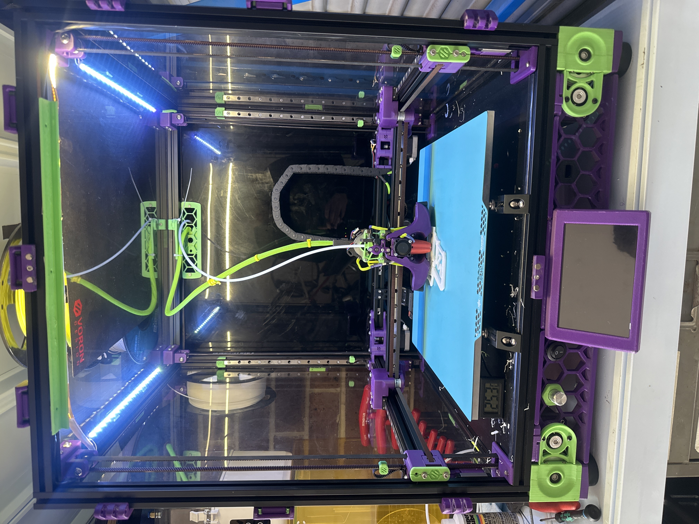

# Voron 2.4 350mm - "Cyber Brain" Configuration

This repository contains the complete Klipper configuration for my Voron 2.4 350mm 3D printer, automatically backed up via the printer's built-in git integration.

## 🗂️ Repository Purpose

- **Automatic Backups**: Configuration files are automatically committed and pushed after every significant change
- **Version Control**: Track configuration evolution and easily rollback problematic changes  
- **Sharing**: Document and share working configurations
- **Disaster Recovery**: Complete config restoration capability




## 🔧 Hardware Configuration

### Main Components
- **Frame**: Voron 2.4 350mm (LDO Kit)
- **Toolhead**: Archetype Mjolnir
- **Extruder**: Sherpa Mini (50:10 gear ratio)
- **Hotend**: Rapido UHF (PT1000, 330°C max)
- **Probe**: Cartographer V2 (touch sensor with dedicated MCU)

### Control Electronics
- **Main Board**: BigTreeTech Octopus V1.1 (STM32F446)
- **Toolhead Board**: LDO Nitehawk 36 (RP2040)
- **Probe MCU**: Cartographer 3D Scanner
- **Host**: Raspberry Pi 4

### Motion System
- **Kinematics**: CoreXY with sensorless homing
- **Z-Axis**: 4x independent steppers (80:16 gear ratio)
- **Steppers**: TMC2209 drivers throughout
- **Max Velocity**: 800mm/s
- **Max Acceleration**: 15,000mm/s²

### Sensors & Features
- **Input Shaping**: ADXL345 accelerometer (Nitehawk-mounted)
- **Bed Leveling**: Quad Gantry Level + Cartographer touch probing
- **Chamber Lighting**: 50x Neopixel LED strip with effects
- **Toolhead LEDs**: 3x GRBW Stealthburner lighting
- **Webcam**: 1280x720@30fps via Crowsnest

## 💾 Software Stack

### Core Firmware
- **Klipper**: Multi-MCU configuration (3x controllers)
- **Moonraker**: API server and update management
- **Mainsail**: Primary web interface
- **KlipperScreen**: Touch panel interface

### Enhanced Features
- **KAMP**: Adaptive meshing and purging system
- **Timelapse**: Automated print photography with hyperlapse
- **LED Effects**: Dynamic lighting based on printer state
- **Mobileraker**: Mobile app integration with push notifications

## 🚀 Key Features

### Automated Print Workflow
- **Smart Start Sequence**: Adaptive bed mesh, gantry leveling, nozzle cleaning
- **KAMP Integration**: Object-aware meshing and logo/line purging
- **Cartographer Touch**: High-precision Z-offset calibration
- **Temperature Management**: Intelligent heat soaking for high-temp materials

### Advanced Macros
- **Filament Management**: Automated load/unload with temperature control
- **Print Control**: Enhanced pause/resume with safe positioning
- **Maintenance**: Nozzle cleaning, PID tuning, speed testing
- **Calibration**: Pressure advance testing, input shaping

### Motion Tuning
- **High Speed Capable**: Tuned for 800mm/s travel, 15k accel
- **Sensorless Homing**: Reliable X/Y homing without physical switches
- **Precision Probing**: Dual-pass mesh with 0.0075mm tolerance
- **Input Shaping**: EI (X: 89.8Hz) / MZV (Y: 48.8Hz)

## 📁 Configuration Structure

```
├── printer.cfg              # Main configuration file
├── mainsail.cfg             # Web interface integration
├── moonraker.conf           # API server configuration
├── MACROs/                  # Custom macro library
│   ├── print_start_macro.cfg
│   ├── voron_useful_macros.cfg
│   ├── fast_qgl.cfg
│   └── TEST_SPEED.cfg
├── KAMP/                    # Adaptive meshing & purging
├── daylight_led.cfg         # Chamber lighting effects
└── autocommit.sh           # Automatic backup script
```

## ⚡ Performance Specifications

- **Print Speed**: Up to 300mm/s (material dependent)
- **Travel Speed**: 800mm/s
- **Acceleration**: 15,000mm/s² (tuned per material)
- **Z Leveling Accuracy**: ±0.0075mm
- **First Layer Precision**: Cartographer touch sensing
- **Heat-up Time**: ~3min to ABS temps (110°C bed, 250°C hotend)

## 🔄 Automatic Backup

The printer runs a git-based backup system that:

- Monitors configuration changes
- Commits files with timestamps and version info
- Pushes to this repository automatically
- Includes database backups (Moonraker history)

**Backup Script**: `autocommit.sh` runs after significant config changes

## 📱 Remote Monitoring

- **Mainsail Interface**: Full remote control and monitoring
- **Mobileraker**: iOS/Android app with notifications
- **Webcam Stream**: Live print monitoring at `/webcam`
- **Timelapse**: Automatic print recording and rendering

## 🛠️ Notable Customizations

### Intelligent Start Sequence
The `PRINT_START` macro provides a comprehensive pre-print routine including temperature-dependent heat soaking, adaptive mesh probing, and nozzle preparation.

### LED Status System  
Chamber and toolhead lighting automatically reflects printer state (idle, heating, printing, error) with smooth transitions and effects.

### KAMP Integration
Adaptive bed meshing only probes the actual print area, significantly reducing start times for smaller objects.

### Maintenance Macros
Extensive library including filament management, calibration routines, and diagnostic tools accessible via the web interface.

---

**Last Updated**: Auto-generated on commit  
**Klipper Version**: Latest stable  
**Hardware Status**: Fully operational ✅

> This configuration represents hundreds of hours of tuning and optimization. Feel free to use as reference, but always verify settings match your specific hardware before applying.
